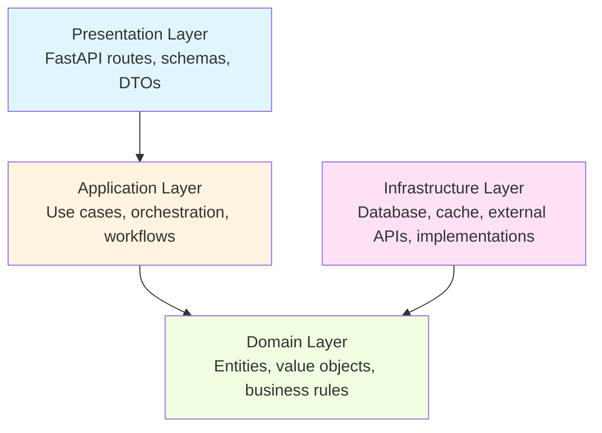

# Python FastAPI Boilerplate

> **Production-ready FastAPI boilerplate with clean architecture, comprehensive observability, and enterprise-grade features**

[](https://www.python.org/downloads/)
[](https://fastapi.tiangolo.com)
[](https://opensource.org/licenses/MIT)
[](https://github.com/astral-sh/ruff)

## 🎯 Overview

A **production-grade FastAPI boilerplate** designed for building scalable, maintainable APIs with enterprise features built-in. Perfect for SaaS applications, microservices, and complex business logic.

**Built with:**
- 🏗️ **Clean Architecture** - Clear separation of concerns across 4 layers
- 🆔 **UUIDv7** - Time-ordered identifiers for distributed systems
- 🏢 **Multi-Tenancy** - Built-in tenant isolation (JWT with ES256)
- 📊 **Full Observability** - OpenTelemetry, structured logging, distributed tracing
- 🔄 **Temporal Workflows** - Durable task orchestration
- ✅ **Comprehensive Testing** - 1,069 tests with 84% coverage → [detailed stats](docs/reference/testing.md#test-statistics)

## ⚡ Quick Start

**Get running in 3 commands:**

```bash
# 1. Install dependencies
pip install uv && uv sync --all-groups

# 2. Start services & run migrations
cp .env.example .env
docker-compose --profile infra up -d
make migrate

# 3. Start API
uv run python main.py
# → API: http://localhost:8000
# → Docs: http://localhost:8000/docs
```

👉 **[Complete setup guide](./GETTING-STARTED.md)** | **[Tutorials](./docs/tutorials/)** | **[Architecture](./docs/reference/architecture.md)**

## 📋 Table of Contents

- [When to Use This](#-when-to-use-this)
- [Features](#-features)
- [Architecture](#-architecture)
- [Documentation](#-documentation)
- [Technology Stack](#-technology-stack)
- [Project Structure](#-project-structure)
- [Contributing](#-contributing)
- [License](#-license)

## 🎯 When to Use This

### ✅ Perfect For

| Use Case | Why It Fits |
|----------|-------------|
| **SaaS Applications** | Multi-tenancy, security, scalability built-in |
| **Microservices** | Clean architecture, distributed tracing, correlation IDs |
| **Complex Business Logic** | Domain-driven design, clear layer separation |
| **High-Performance APIs** | Async throughout, Redis caching, connection pooling |
| **Team Collaboration** | Type safety, clear boundaries, comprehensive docs |
| **Production Systems** | Observability, error handling, graceful degradation |

### ❌ Probably Overkill For

- **Simple CRUD APIs** - Too much structure for basic REST operations
- **Prototypes/MVPs** - Consider simpler FastAPI templates for rapid experimentation
- **Learning Projects** - Start with official FastAPI tutorials first
- **Single-page forms** - Use lightweight frameworks

### 🤔 Decision Matrix

| Your Requirement | Use This | Consider Alternative |
|------------------|----------|---------------------|
| Multi-tenancy required | ✅ Yes | ❌ No |
| >10K requests/day expected | ✅ Yes | 🤷 Maybe |
| Background jobs needed | ✅ Yes | ❌ No |
| Team size >3 developers | ✅ Yes | 🤷 Maybe |
| Complex business rules | ✅ Yes | ❌ No |
| Production deployment | ✅ Yes | 🤷 Maybe |
| Just learning FastAPI | ❌ No | ✅ Yes |
| Simple CRUD only | ❌ No | ✅ Yes |

## 🚀 Features

### Core Framework

- **⚡ FastAPI** - Modern async web framework with auto-generated docs
- **🐍 Python 3.12-3.14** - Latest Python with type parameter syntax
- **🏗️ Clean Architecture** - 4-layer architecture (Domain → Application → Infrastructure → Presentation)
- **💉 Dependency Injection** - Container-based DI with `dependency-injector`
- **✅ Type Safety** - Full type hints throughout with MyPy validation

### Data & Storage

- **🗄️ PostgreSQL** - Async database with SQLAlchemy 2.0
- **🔄 Redis** - High-performance caching with compression (zstd)
- **🆔 UUIDv7** - Time-ordered, sortable UUIDs for distributed systems
- **📄 Cursor Pagination** - Efficient pagination for large datasets
- **🔄 Database Migrations** - Atlas for declarative schema management

### Background Processing

- **⚙️ Temporal** - Durable workflow orchestration with built-in observability
- **📬 Email Service** - Async email sending with Mailpit for dev/testing
- **🔄 Async Tasks** - Background job processing with retry logic

### Security & Auth

- **🔐 API Signature Validation** - HMAC-SHA256 request signing for partner APIs
- **🛡️ Security Headers** - CSP, HSTS, X-Frame-Options, etc.
- **🚦 Rate Limiting** - Per-client rate limiting with Redis
- **📋 Log Sanitization** - Automatic PII/secret removal from logs
- **🔒 Tenant Isolation** - Multi-tenant data segregation via JWT

### Observability & Monitoring

- **📊 OpenTelemetry** - Distributed tracing with OTLP export
- **📝 Structured Logging** - JSON logs with `structlog`
- **🔗 Correlation IDs** - Cross-service request tracking
- **🔍 Trace Context Propagation** - W3C Trace Context standard
- **📊 Request Context** - Extract client IP, trace IDs from headers

### Developer Experience

- **🧪 Comprehensive Testing** → [detailed stats](docs/reference/testing.md#test-statistics)
- **🎯 Test Factories** - Reusable test data factories
- **🔬 Property-Based Testing** - Hypothesis strategies for edge cases
- **📚 Auto-Generated Docs** - OpenAPI/Swagger UI
- **🐳 Docker Support** - Complete dev environment with docker-compose
- **🔧 Pre-commit Hooks** - Automated code quality (Ruff, MyPy)
- **⚡ Fast Package Manager** - UV for 10-100x faster dependency resolution

### Resilience & Performance

- **🔌 Circuit Breaker** - Fault tolerance for external services
- **💾 Redis Caching** - Configurable TTL with compression
- **🔄 Connection Pooling** - Efficient database connection management
- **♻️ Graceful Degradation** - Fallback strategies for service failures

## 🏛️ Architecture

This boilerplate follows **Clean Architecture** principles with clear separation of concerns:



**Key principles:**
- **Dependency Inversion** - Inner layers don't depend on outer layers
- **Single Responsibility** - Each layer has one clear purpose
- **Interface Segregation** - Use interfaces/protocols for dependencies
- **Repository Pattern** - Abstract data access
- **Unit of Work** - Manage transactions consistently

👉 **[Complete architecture guide](./docs/reference/architecture.md)** | **[Design decisions](./docs/explanation/design-decisions.md)**

## 📚 Documentation

### Getting Started
- **[Quick Start](./GETTING-STARTED.md)** - Get running in 5 minutes
- **[Installation Tutorial](./docs/tutorials/00-installation.md)** - Complete setup guide
- **[Your First API](./docs/tutorials/01-first-api.md)** - Build your first endpoint

### How-To Guides (Task-Oriented)
- [Add a new endpoint](./docs/how-to/add-endpoint.md)
- [Add a database model](./docs/how-to/add-model.md)
- [Configure authentication](./docs/how-to/configure-auth.md)
- [Deploy to production](./docs/how-to/deployment.md)
- [Debug issues](./docs/how-to/debugging.md)

### Reference (Technical Specs)
- [API Reference](./docs/reference/api.md) - All endpoints documented
- [Configuration](./docs/reference/configuration.md) - Environment variables
- [Architecture](./docs/reference/architecture.md) - System design
- [Testing Guide](./docs/reference/testing.md) - Testing strategy

### Explanation (Deep Dives)
- [Clean Architecture](./docs/explanation/clean-architecture.md) - Why this pattern?
- [Design Decisions](./docs/explanation/design-decisions.md) - ADRs and rationale
- [Multi-Tenancy](./docs/explanation/multi-tenancy.md) - Tenant isolation approach
- [Observability](./docs/explanation/observability.md) - Telemetry strategy

## 🛠️ Technology Stack

### Core
| Technology | Version | Purpose |
|------------|---------|---------|
| **Python** | 3.12-3.14 | Programming language |
| **FastAPI** | 0.121+ | Web framework |
| **Pydantic** | 2.12+ | Data validation |
| **SQLAlchemy** | 2.0+ | ORM & database toolkit |
| **PostgreSQL** | 16+ | Primary database |
| **Redis** | 7+ | Caching & rate limiting |

### Infrastructure
| Technology | Version | Purpose |
|------------|---------|---------|
| **Temporal** | 1.8+ | Workflow orchestration |
| **OpenTelemetry** | 1.38+ | Distributed tracing |
| **Atlas** | Latest | Database schema migrations |
| **UV** | Latest | Fast package manager |
| **Docker** | Latest | Containerization |

### Development
| Technology | Version | Purpose |
|------------|---------|---------|
| **Pytest** | 8.4+ | Testing framework |
| **Ruff** | 0.14+ | Linting & formatting |
| **MyPy** | 1.18+ | Static type checking |
| **Pre-commit** | 4.3+ | Git hooks |
| **Hypothesis** | Latest | Property-based testing |

## 📁 Project Structure

```
python-fast-forge/
├── src/                           # Source code
│   ├── domain/                    # Domain layer (entities, business rules)
│   │   ├── models/                # Domain models
│   │   ├── exceptions.py          # Domain exceptions
│   │   └── pagination.py          # Pagination value objects
│   ├── app/                       # Application layer (use cases)
│   │   ├── usecases/              # Business use cases
│   │   └── tasks/                 # Background tasks
│   ├── infrastructure/            # Infrastructure layer (implementations)
│   │   ├── persistence/           # Database (SQLAlchemy)
│   │   ├── repositories/          # Data access repositories
│   │   ├── cache/                 # Redis caching
│   │   ├── security/              # Security implementations
│   │   ├── telemetry/             # OpenTelemetry setup
│   │   └── patterns/              # Circuit breaker, etc.
│   ├── presentation/              # Presentation layer (API)
│   │   ├── api/                   # FastAPI routes
│   │   ├── schemas/               # Request/response DTOs
│   │   └── mappers/               # DTO ↔ Domain mapping
│   ├── external/                  # External service clients
│   ├── utils/                     # Shared utilities
│   └── container.py               # Dependency injection container
├── tests/                         # Test suite
│   ├── unit/                      # Unit tests (19 files)
│   ├── integration/               # Integration tests (9 files)
│   ├── factories.py               # Test data factories
│   └── strategies.py              # Hypothesis strategies
├── migrations/                    # Atlas database migrations (SQL)
├── load_models.py                 # SQLAlchemy model loader for Atlas
├── atlas.hcl                      # Atlas migration configuration
├── config/                        # Configuration files
├── docs/                          # Documentation
│   ├── tutorials/                 # Step-by-step tutorials
│   ├── how-to/                    # Task-oriented guides
│   ├── reference/                 # Technical reference
│   └── explanation/               # Deep dives & ADRs
├── main.py                        # API entry point
├── worker.py                      # Temporal worker
├── docker-compose.yml             # Dev environment
└── pyproject.toml                 # Project configuration
```

## 🚀 Getting Started

### Prerequisites

- **Python 3.12+** ([Download](https://www.python.org/downloads/))
- **Docker & Docker Compose** ([Download](https://www.docker.com/))
- **Git** ([Download](https://git-scm.com/))

### Installation

```bash
# 1. Clone repository
git clone https://github.com/thaithienvanid/python-fast-forge.git
cd python-fast-forge

# 2. Install UV (fast package manager)
pip install uv

# 3. Install all dependencies (dev, test, security tools)
uv sync --all-groups

# 4. Copy environment file
cp .env.example .env

# 5. Start infrastructure (PostgreSQL, Redis, Temporal, Mailpit)
docker-compose --profile infra up -d

# 6. Install Atlas CLI (one-time setup)
curl -sSf https://atlasgo.sh | sh

# 7. Run database migrations
make migrate

# 8. Start API server (with hot reload)
uv run python main.py

# 8. (Optional) Start Temporal worker in another terminal
uv run python worker.py
```

### Verify Installation

```bash
# Check API health
curl http://localhost:8000/health

# Expected response:
# {"status":"healthy","version":"0.1.0"}

# Visit interactive docs
open http://localhost:8000/docs
```

### Access Services

| Service | URL | Purpose |
|---------|-----|---------|
| API | http://localhost:8000 | Main API |
| API Docs | http://localhost:8000/docs | Swagger UI |
| ReDoc | http://localhost:8000/redoc | Alternative docs |
| Mailpit | http://localhost:8025 | Email testing |
| Temporal UI | http://localhost:8080 | Workflow dashboard |
| PostgreSQL | localhost:5432 | Database |
| Redis | localhost:6379 | Cache |

## 🧪 Testing

```bash
# Run all tests
make test

# Run with coverage report
make test-cov

# Run only unit tests
uv run pytest tests/unit/

# Run only integration tests
uv run pytest tests/integration/

# Run specific test file
uv run pytest tests/unit/test_user_model.py

# Run tests in parallel (faster)
uv run pytest -n auto
```

👉 **[Complete testing guide](./docs/reference/testing.md)**

## 🔧 Development

```bash
# Install pre-commit hooks (auto-format, lint, type-check)
uv run pre-commit install

# Run linting
make lint

# Run type checking
make type-check

# Format code
make format

# Create new migration
make migrate-create m="Description"

# View migration status
make migrate-status

# Inspect schema
make schema-inspect
```

👉 **[Development workflow guide](./docs/how-to/development-workflow.md)**

## 📦 Deployment

This boilerplate is production-ready with:
- ✅ Docker multi-stage builds
- ✅ Health checks
- ✅ Graceful shutdown
- ✅ Environment-based configuration
- ✅ Secrets management
- ✅ Horizontal scaling support

```bash
# Build production image
docker build -f Dockerfile -t my-api:latest .

# Run in production mode
docker-compose --profile infra --profile app up -d
```

👉 **[Complete deployment guide](./docs/how-to/deployment.md)**

## 🤝 Contributing

We welcome contributions! Please see our [Contributing Guide](./CONTRIBUTING.md) for details.

**Quick links:**
- [Code of Conduct](./CONTRIBUTING.md#code-of-conduct)
- [Development Setup](./CONTRIBUTING.md#development-setup)
- [Pull Request Process](./CONTRIBUTING.md#pull-request-process)
- [Coding Standards](./CONTRIBUTING.md#coding-standards)

## 📄 License

This project is licensed under the **MIT License** - see the [LICENSE](./LICENSE) file for details.

## 🙏 Acknowledgments

Built with these amazing technologies:
- [FastAPI](https://fastapi.tiangolo.com/) - Modern Python web framework
- [Temporal](https://temporal.io/) - Durable workflow engine
- [SQLAlchemy](https://www.sqlalchemy.org/) - Python SQL toolkit
- [OpenTelemetry](https://opentelemetry.io/) - Observability framework
- [Pydantic](https://docs.pydantic.dev/) - Data validation

## 📞 Support & Community

- **Documentation**: [Full docs](./docs/)
- **Issues**: [GitHub Issues](https://github.com/thaithienvanid/python-fast-forge/issues)
- **Discussions**: [GitHub Discussions](https://github.com/thaithienvanid/python-fast-forge/discussions)

---

**⭐ Star this repo** if you find it helpful!
