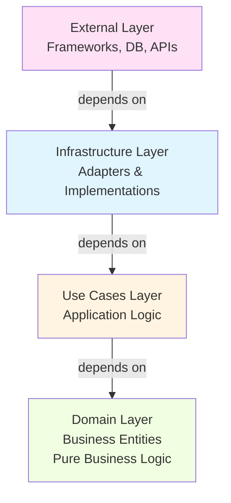
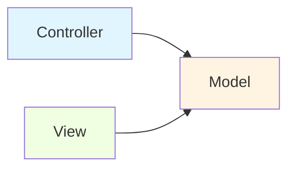
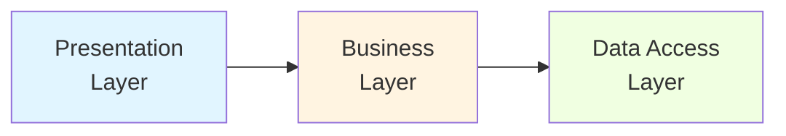
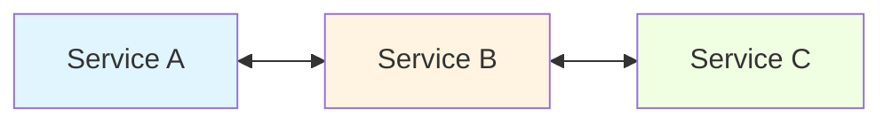
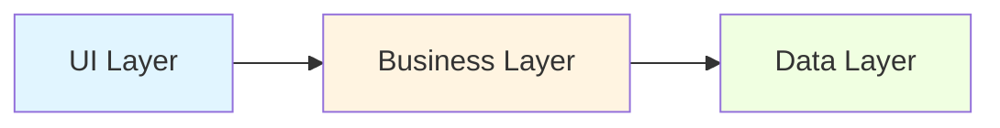
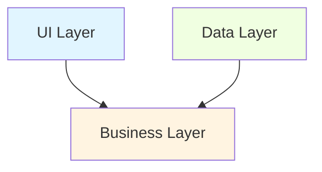

# Why Clean Architecture?

This document explains the philosophy, principles, and rationale behind using Clean Architecture in this FastAPI boilerplate.

## Overview

Clean Architecture is a software design philosophy that emphasizes separation of concerns, testability, and independence from frameworks, databases, and external agencies. This boilerplate implements Uncle Bob's Clean Architecture principles adapted for Python and FastAPI.

## Table of Contents

- [Philosophy and Principles](#philosophy-and-principles)
- [Benefits](#benefits)
- [Trade-offs](#trade-offs)
- [When NOT to Use Clean Architecture](#when-not-to-use-clean-architecture)
- [Comparison with Alternatives](#comparison-with-alternatives)
- [Evolution Path](#evolution-path)
- [Real-World Adoption](#real-world-adoption)
- [Common Misconceptions](#common-misconceptions)

## Philosophy and Principles

### Core Philosophy

Clean Architecture is built on the principle that **business logic should be independent of delivery mechanisms and external dependencies**. The architecture achieves this through:

1. **Dependency Inversion**: High-level policies don't depend on low-level details
2. **Separation of Concerns**: Each layer has a single, well-defined responsibility
3. **Testability**: Business logic can be tested without external dependencies
4. **Independence**: The system works regardless of frameworks, databases, or UI

### The Dependency Rule

**Dependencies always point inward**:



**Key Insight**: Inner layers NEVER depend on outer layers. This means domain entities don't know about databases, and use cases don't know about FastAPI.

## Benefits

### 1. **Testability**

Clean Architecture makes testing dramatically easier:

```python
# Test use case WITHOUT database or FastAPI
def test_create_user_use_case():
    # Arrange: Mock repository
    mock_repo = MagicMock(spec=UserRepository)
    use_case = CreateUserUseCase(user_repo=mock_repo)

    # Act
    result = use_case.execute(CreateUserInput(...))

    # Assert
    assert result.success
    mock_repo.create.assert_called_once()
```

**Benefits**:
- Unit tests run in milliseconds (no I/O)
- Tests are isolated and deterministic
- Easy to test edge cases and error conditions
- No need for test databases or Docker containers

### 2. **Maintainability**

Changes are localized and predictable:

- **Database migration**: Only affects repository layer
- **API endpoint change**: Only affects API layer
- **Business logic change**: Only affects use case layer
- **Add new framework**: Create new adapters, business logic unchanged

### 3. **Independence from Frameworks**

Your business logic doesn't depend on FastAPI, SQLAlchemy, or any framework:

```python
# Domain entity - pure Python, no frameworks
@dataclass
class User:
    id: UUID
    email: str
    username: str

    def validate_email(self) -> bool:
        # Business rule, no framework dependencies
        return "@" in self.email and "." in self.email.split("@")[1]
```

**Benefits**:
- Migrate from FastAPI to Flask? Just rewrite API layer
- Switch from PostgreSQL to MongoDB? Just rewrite repository layer
- Business logic remains untouched

### 4. **Scalability**

Clean Architecture scales in multiple dimensions:

- **Team Scale**: Different teams can work on different layers
- **Code Scale**: Add features without touching existing code
- **Deployment Scale**: Extract use cases into microservices easily

### 5. **Explicit Dependencies**

Dependency injection makes all dependencies explicit:

```python
class CreateUserUseCase:
    def __init__(
        self,
        user_repo: UserRepository,  # Explicit
        email_service: EmailService,  # Explicit
        uow: UnitOfWork,  # Explicit
    ):
        self.user_repo = user_repo
        self.email_service = email_service
        self.uow = uow
```

**Benefits**:
- Easy to understand what a use case needs
- Easy to mock dependencies in tests
- No hidden global state or singletons

## Trade-offs

### Costs

1. **More Code**: More files, more interfaces, more boilerplate
2. **Learning Curve**: Team needs to understand architecture principles
3. **Over-Engineering Risk**: Small projects might not need this complexity
4. **Initial Velocity**: Slower to start compared to Rails/Django approach

### When Costs are Worth It

Clean Architecture pays off when:

- **Long-term project** (>6 months lifespan)
- **Multiple developers** (>2 people)
- **Changing requirements** (business evolves)
- **High test coverage** requirement (>80%)
- **Need to switch technologies** (database, framework, cloud provider)

### When Costs Outweigh Benefits

Consider simpler architectures for:

- **Prototypes** or MVPs (< 3 months)
- **Solo projects** with stable requirements
- **CRUD applications** with minimal business logic
- **Scripts** or one-off tools

## When NOT to Use Clean Architecture

### 1. Simple CRUD Applications

If your app is just:
```python
@app.post("/users")
def create_user(user: UserCreate):
    db_user = User(**user.dict())
    db.add(db_user)
    db.commit()
    return db_user
```

**Don't use Clean Architecture**. Just use FastAPI + SQLAlchemy directly.

### 2. Rapid Prototypes

If you need to:
- Validate an idea in 2 weeks
- Demo to stakeholders
- Throw away code after testing

**Don't use Clean Architecture**. Speed matters more than structure.

### 3. Single-Developer Projects

If:
- You're the only developer
- Requirements are stable
- Code won't be maintained long-term

**Consider simpler alternatives**. The overhead might not be worth it.

### 4. Team Doesn't Understand It

If your team:
- Doesn't know Clean Architecture principles
- Doesn't want to learn
- Prefers Rails/Django active-record pattern

**Don't force it**. Architecture should match team capabilities.

## Comparison with Alternatives

### vs. MVC (Model-View-Controller)

**MVC:**


**Pros**:
- Simple and well-known
- Fast to implement
- Good for CRUD apps

**Cons**:
- Business logic ends up in models or controllers
- Hard to test without database
- Frameworks tightly coupled

**When to use MVC**: Simple web apps, CRUD operations, small teams

### vs. Layered Architecture

**Layered:**


**Pros**:
- Simple to understand
- Clear separation of concerns
- Works well for many apps

**Cons**:
- Layers can still be tightly coupled
- Business logic depends on data layer
- Hard to swap databases

**When to use Layered**: Medium-sized apps, stable technology stack

### vs. Microservices

**Microservices:**


**Pros**:
- Independent deployment
- Technology diversity
- Team autonomy

**Cons**:
- Operational complexity
- Distributed system challenges
- Network latency

**When to use Microservices**: Large teams, different scaling needs per service

**Note**: Clean Architecture works WITHIN each microservice!

### vs. Monolithic Active Record

**Active Record (Rails/Django):**
```python
class User(db.Model):
    email = db.Column(db.String)

    def send_welcome_email(self):
        # Business logic mixed with persistence
        mailer.send(self.email, "Welcome!")
```

**Pros**:
- Very fast development
- Simple for CRUD
- Less boilerplate

**Cons**:
- Business logic in models
- Hard to test without database
- Database changes affect business logic

**When to use Active Record**: Startups, MVPs, CRUD-heavy apps

## Evolution Path

You don't need to start with Clean Architecture. Here's a migration path:

### Phase 1: Monolithic Script (Day 1-30)

```python
# Everything in one file
from fastapi import FastAPI
from sqlalchemy import create_engine

app = FastAPI()
engine = create_engine("postgresql://...")

@app.post("/users")
def create_user(email: str):
    # Direct database access
    conn = engine.connect()
    conn.execute("INSERT INTO users VALUES (?)", email)
    conn.close()
    return {"email": email}
```

**Good for**: Prototypes, validation

### Phase 2: Add Service Layer (Month 2-3)

```python
# Separate business logic from API
class UserService:
    def create_user(self, email: str) -> User:
        # Business logic here
        user = User(email=email)
        db.session.add(user)
        db.session.commit()
        return user

@app.post("/users")
def create_user(email: str):
    return user_service.create_user(email)
```

**Good for**: Growing apps, multiple endpoints

### Phase 3: Add Repository Layer (Month 4-6)

```python
# Separate data access from business logic
class UserRepository:
    def create(self, user: User) -> User:
        db.session.add(user)
        db.session.commit()
        return user

class UserService:
    def __init__(self, repo: UserRepository):
        self.repo = repo

    def create_user(self, email: str) -> User:
        user = User(email=email)
        return self.repo.create(user)
```

**Good for**: Testing, multiple data sources

### Phase 4: Full Clean Architecture (Month 6+)

```python
# Complete separation of concerns
# Domain → Use Cases → Repositories → API
# (This boilerplate is here)
```

**Good for**: Long-term maintenance, large teams

## Real-World Adoption

### Success Stories

**1. Netflix**
- Uses Clean Architecture principles in many services
- Testability critical for 24/7 availability
- Technology-independent business logic

**2. Uber**
- Domain-Driven Design + Clean Architecture
- Handles complex business rules
- Multiple teams working independently

**3. Spotify**
- Hexagonal Architecture (similar to Clean)
- Thousands of microservices
- Each service uses Clean principles internally

### Lessons Learned

From teams using Clean Architecture:

1. **Start Simple**: Don't over-engineer early
2. **Train Team**: Invest in education and documentation
3. **Be Pragmatic**: Break rules when it makes sense
4. **Use Tools**: Generate boilerplate with templates
5. **Measure Impact**: Track test coverage and velocity

## Common Misconceptions

### Myth 1: "It's Just Layers"

**Reality**: It's about **dependency direction**, not just layers.

Traditional layered architecture:

_Each layer depends on the layer below_

Clean Architecture:

_Everything depends on business_

### Myth 2: "Too Much Boilerplate"

**Reality**: Boilerplate is **explicit contracts** and **type safety**.

What looks like boilerplate:
```python
class CreateUserUseCase:
    def __init__(self, user_repo: UserRepository):
        self.user_repo = user_repo
```

Is actually:
- Explicit dependency declaration
- Type-safe interface
- Easy to test
- Self-documenting code

### Myth 3: "Slows Down Development"

**Reality**: Slows down **initial** development, speeds up **maintenance**.

- Week 1: Clean Architecture slower (setup overhead)
- Month 1: About the same speed
- Month 6+: Clean Architecture faster (easy to add features)
- Year 1+: Much faster (minimal tech debt)

### Myth 4: "Only for Large Projects"

**Reality**: Benefits appear at different scales:

- **Small projects** (1-3 devs): Testability benefit
- **Medium projects** (3-10 devs): Maintainability benefit
- **Large projects** (10+ devs): Team independence benefit

### Myth 5: "Must Follow All Rules"

**Reality**: **Pragmatism over purity**.

It's okay to:
- Pass domain entities to API if needed
- Combine layers for simple features
- Use active record for admin panels
- Break rules with justification

## Conclusion

Clean Architecture is a **powerful tool**, not a silver bullet:

**Use it when**:
- Long-term project (>6 months)
- Multiple developers
- High test coverage requirements
- Changing business rules
- Need technology independence

**Don't use it when**:
- Rapid prototypes
- Simple CRUD apps
- Solo projects with stable requirements
- Team doesn't understand it

**Remember**: The goal is **maintainable, testable software**. If Clean Architecture helps achieve that, use it. If a simpler approach works better for your context, use that instead.

## Further Reading

- [Clean Architecture (Robert C. Martin)](https://blog.cleancoder.com/uncle-bob/2012/08/13/the-clean-architecture.html)
- [Hexagonal Architecture](https://alistair.cockburn.us/hexagonal-architecture/)
- [Domain-Driven Design (Eric Evans)](https://www.domainlanguage.com/ddd/)
- [Architecture Patterns (Martin Fowler)](https://martinfowler.com/architecture/)

## Next Steps

- Read [Design Decisions](design-decisions.md) for specific technology choices
- See [Architecture Reference](../reference/architecture.md) for implementation details
- Check [Multi-tenancy](multi-tenancy.md) for advanced patterns
