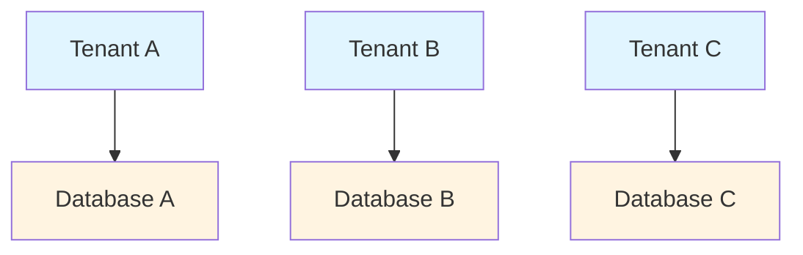
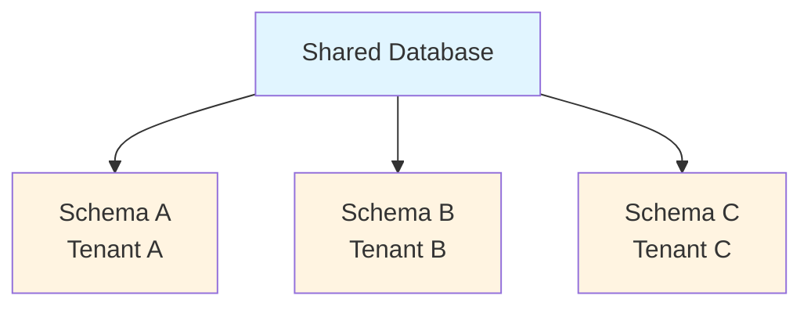
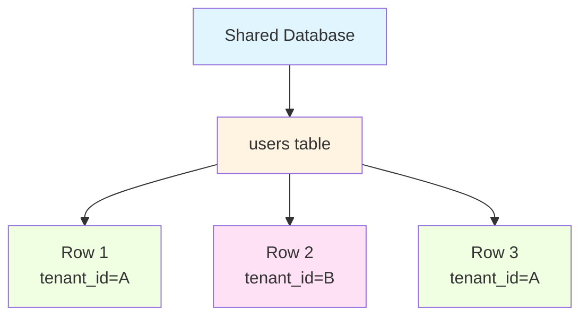

# Multi-Tenancy Implementation

This document provides a deep dive into the multi-tenancy architecture used in this FastAPI boilerplate, explaining implementation details, security considerations, and best practices.

## Overview

Multi-tenancy allows a single application instance to serve multiple customers (tenants) while keeping their data completely isolated. This boilerplate implements **row-level multi-tenancy** where all tenants share the same database and tables, but data is isolated using a `tenant_id` column.

## Table of Contents

- [Architecture Overview](#architecture-overview)
- [Tenant Isolation at All Layers](#tenant-isolation-at-all-layers)
- [Security Considerations](#security-considerations)
- [Performance Optimization](#performance-optimization)
- [Migration Strategies](#migration-strategies)
- [Troubleshooting](#troubleshooting)
- [Real-World Scenarios](#real-world-scenarios)

## Architecture Overview

### Multi-Tenancy Approaches

**1. Database per Tenant** (Not used here)


Pros: Maximum isolation
Cons: Expensive, hard to maintain, poor resource utilization

**2. Schema per Tenant** (Not used here)


Pros: Good isolation, easier than DB per tenant
Cons: Schema management complex, PostgreSQL limit ~1000 schemas

**3. Row-Level Tenancy** (✅ What we use)


Pros: Cost-effective, easy to scale, resource sharing
Cons: Must ensure queries filter by tenant_id

### Why Row-Level Tenancy?

We chose row-level tenancy because:

1. **Cost-Effective**: Single database for all tenants
2. **Easy to Add Tenants**: Just insert a new tenant row
3. **Shared Resources**: Efficient use of connections, memory
4. **Simpler Operations**: Single backup, single migration
5. **Cross-Tenant Analytics**: Possible when needed

## Tenant Isolation at All Layers

Multi-tenancy must be enforced at EVERY layer to prevent data leakage.

### Layer 1: API Layer (FastAPI)

**Tenant Extraction from X-Tenant-Token Header**:

This boilerplate uses JWT tokens with ES256 (Elliptic Curve Digital Signature) for secure tenant authentication. The tenant ID is extracted from the `X-Tenant-Token` header.

```python
# src/presentation/api/dependencies.py
from src.utils.tenant_auth import decode_tenant_token

async def get_tenant_id(
    x_tenant_token: Annotated[str | None, Header()] = None,
    settings: Annotated[Settings, Depends(get_settings)] = None,
) -> UUID | None:
    """Extract tenant ID from X-Tenant-Token (JWT with ES256).

    Returns:
        UUID of tenant if valid token provided, None for no tenant isolation

    Raises:
        401: If token is invalid, expired, or malformed
    """
    if x_tenant_token:
        # Decode and validate JWT with ES256
        claims = decode_tenant_token(x_tenant_token, settings)
        return claims.tenant_id

    # No tenant isolation
    return None
```

**Security Features**:
- **ES256 Algorithm**: Asymmetric cryptography with public/private key pairs
- **Token Expiration**: Tokens auto-expire (default: 30 minutes)
- **Signature Verification**: Invalid signatures rejected
- **Structured Errors**: Returns ErrorResponse with error codes

**Inject Tenant into Endpoints**:

```python
@router.get("/users")
async def list_users(
    tenant_id: UUID | None = Depends(get_tenant_id),
    user_service: UserService = Depends(),
):
    if tenant_id is None:
        # No tenant isolation - return all users or handle appropriately
        raise HTTPException(401, "X-Tenant-Token required")

    # Tenant-isolated query
    return await user_service.list_users(tenant_id=tenant_id)
```

**Creating Tenant Tokens**:

```python
from src.utils.tenant_auth import create_tenant_token
from datetime import timedelta

# Create token with default expiration (30 minutes)
token = create_tenant_token(tenant_id)

# Create token with custom expiration
token = create_tenant_token(
    tenant_id,
    expires_delta=timedelta(hours=2)
)

# Client uses token in requests
# curl -H "X-Tenant-Token: eyJhbGc..." /api/v1/users
```

### Layer 2: Use Case Layer

**Use cases always receive tenant_id**:

```python
class ListUsersUseCase:
    def __init__(self, user_repo: UserRepository):
        self.user_repo = user_repo

    async def execute(
        self, tenant_id: UUID, limit: int = 100
    ) -> List[User]:
        # Always pass tenant_id to repository
        return await self.user_repo.list(
            tenant_id=tenant_id,
            limit=limit
        )
```

**Never allow null tenant_id**:

```python
# ❌ BAD: tenant_id could be None
async def execute(self, tenant_id: Optional[UUID] = None):
    return await self.user_repo.list(tenant_id=tenant_id)

# ✅ GOOD: tenant_id is required
async def execute(self, tenant_id: UUID):
    return await self.user_repo.list(tenant_id=tenant_id)
```

### Layer 3: Repository Layer

**All queries filter by tenant_id**:

```python
class SQLAlchemyUserRepository(UserRepository):
    async def list(
        self, tenant_id: UUID, limit: int = 100
    ) -> List[User]:
        stmt = (
            select(UserModel)
            .where(UserModel.tenant_id == tenant_id)  # ✅ Always filter
            .limit(limit)
        )
        result = await self.session.execute(stmt)
        return [user.to_entity() for user in result.scalars()]
```

**Repository base class enforces tenant filtering**:

```python
class TenantAwareRepository(ABC):
    """Base repository that enforces tenant filtering."""

    def _add_tenant_filter(
        self, stmt: Select, tenant_id: UUID
    ) -> Select:
        """Add tenant_id filter to all queries."""
        return stmt.where(self.model.tenant_id == tenant_id)

    async def get(
        self, id: UUID, tenant_id: UUID
    ) -> Optional[T]:
        stmt = select(self.model).where(
            self.model.id == id,
            self.model.tenant_id == tenant_id,  # Double-check
        )
        result = await self.session.execute(stmt)
        return result.scalar_one_or_none()
```

### Layer 4: Database Layer

**Database schema with tenant_id**:

```sql
CREATE TABLE users (
    id UUID PRIMARY KEY,
    tenant_id UUID NOT NULL,
    email VARCHAR(255) NOT NULL,
    username VARCHAR(100) NOT NULL,
    created_at TIMESTAMP NOT NULL,

    -- Enforce uniqueness per tenant
    UNIQUE (tenant_id, email),
    UNIQUE (tenant_id, username),

    -- Index for fast tenant filtering
    INDEX idx_users_tenant_id (tenant_id)
);

-- Foreign key to tenants table
ALTER TABLE users
ADD CONSTRAINT fk_users_tenant
FOREIGN KEY (tenant_id) REFERENCES tenants(id);
```

**Row-Level Security (RLS) in PostgreSQL** (Optional extra security):

```sql
-- Enable RLS on table
ALTER TABLE users ENABLE ROW LEVEL SECURITY;

-- Create policy: users can only see their tenant's data
CREATE POLICY tenant_isolation_policy ON users
    USING (tenant_id = current_setting('app.current_tenant_id')::UUID);

-- Set tenant in session
SET app.current_tenant_id = '<tenant-uuid>';
```

## Security Considerations

### Attack Vectors

**1. Missing Tenant Filter**

```python
# ❌ VULNERABILITY: No tenant filter
async def get_user(self, user_id: UUID) -> User:
    stmt = select(UserModel).where(UserModel.id == user_id)
    # Any user from any tenant can be accessed!
    return await self.session.execute(stmt)

# ✅ SECURE: Always filter by tenant
async def get_user(self, user_id: UUID, tenant_id: UUID) -> User:
    stmt = select(UserModel).where(
        UserModel.id == user_id,
        UserModel.tenant_id == tenant_id,  # ✅ Protection
    )
    return await self.session.execute(stmt)
```

**2. Tenant ID Injection**

```python
# ❌ VULN: Tenant from user input
@router.get("/users/{user_id}")
async def get_user(
    user_id: UUID,
    tenant_id: UUID = Query(...),  # ❌ Attacker controls this!
):
    return await user_service.get(user_id, tenant_id)

# ✅ SECURE: Tenant from X-Tenant-Token header
@router.get("/users/{user_id}")
async def get_user(
    user_id: UUID,
    tenant_id: UUID | None = Depends(get_tenant_id),  # ✅ From JWT
):
    if tenant_id is None:
        raise HTTPException(401, "X-Tenant-Token required")
    return await user_service.get(user_id, tenant_id)
```

**3. Cross-Tenant Relationships**

```python
# ❌ VULN: Foreign key without tenant check
class Order(Base):
    user_id = Column(UUID, ForeignKey('users.id'))  # ❌ Any user!

# ✅ SECURE: Composite foreign key with tenant
class Order(Base):
    tenant_id = Column(UUID, nullable=False)
    user_id = Column(UUID, nullable=False)
    __table_args__ = (
        ForeignKeyConstraint(
            ['tenant_id', 'user_id'],
            ['users.tenant_id', 'users.id']
        ),  # ✅ Must match tenant
    )
```

### Security Checklist

- [ ] All tables have `tenant_id` column with NOT NULL
- [ ] All repositories filter by `tenant_id`
- [ ] Tenant extracted from X-Tenant-Token header (JWT with ES256), not user input
- [ ] JWT tokens use ES256 algorithm (asymmetric cryptography)
- [ ] Tokens have expiration time configured
- [ ] Error responses use ErrorResponse class with error codes
- [ ] Foreign keys include `tenant_id`
- [ ] Unique constraints include `tenant_id`
- [ ] Indexes include `tenant_id` as first column
- [ ] No queries without `tenant_id` filter
- [ ] Integration tests verify tenant isolation

## Performance Optimization

### Database Indexes

**Always index tenant_id FIRST**:

```sql
-- ❌ BAD: tenant_id not first
CREATE INDEX idx_users_email ON users(email, tenant_id);
-- Query: WHERE tenant_id = X AND email = Y
-- Index can't be used efficiently!

-- ✅ GOOD: tenant_id first
CREATE INDEX idx_users_tenant_email ON users(tenant_id, email);
-- Query benefits from index!
```

**Why?** PostgreSQL can use index prefix. Starting with `tenant_id` allows efficient filtering.

### Query Patterns

**Use tenant_id in all WHERE clauses**:

```python
# ✅ Efficient: Index on (tenant_id, created_at)
stmt = select(Order).where(
    Order.tenant_id == tenant_id,  # Index prefix
    Order.created_at >= start_date,
)

# ❌ Inefficient: Missing tenant_id
stmt = select(Order).where(
    Order.created_at >= start_date,  # Full table scan!
)
```

### Connection Pooling

**Single connection pool for all tenants**:

```python
# ✅ GOOD: Shared pool (default)
engine = create_async_engine(
    DATABASE_URL,
    pool_size=20,  # Shared across all tenants
    max_overflow=10,
)

# ❌ BAD: Pool per tenant (don't do this)
tenant_engines = {
    tenant_id: create_async_engine(DATABASE_URL, pool_size=5)
    for tenant_id in all_tenant_ids
}
# This wastes connections and memory!
```

### Caching Strategies

**Include tenant_id in cache keys**:

```python
# Cache key format: "{tenant_id}:{entity}:{id}"
cache_key = f"{tenant_id}:user:{user_id}"
cached_user = await redis.get(cache_key)

if not cached_user:
    user = await user_repo.get(user_id, tenant_id)
    await redis.set(cache_key, user, ex=3600)
```

## Migration Strategies

### From Single-Tenant to Multi-Tenant

**Step 1: Add tenant_id column (nullable)**:

```sql
-- Atlas migration
-- Add tenant_id column (nullable initially)
ALTER TABLE users ADD COLUMN tenant_id UUID;

-- Create default tenant
INSERT INTO tenants (id, name) VALUES (gen_random_uuid(), 'Default');

-- Set all existing rows to default tenant
UPDATE users SET tenant_id = (SELECT id FROM tenants WHERE name = 'Default');

-- Now make it NOT NULL
ALTER TABLE users ALTER COLUMN tenant_id SET NOT NULL;

-- Add foreign key constraint
ALTER TABLE users ADD CONSTRAINT fk_users_tenant_id 
    FOREIGN KEY (tenant_id) REFERENCES tenants(id) ON DELETE CASCADE;
```

**Step 2: Add indexes**:

```python
def upgrade():
    op.create_index('idx_users_tenant_id', 'users', ['tenant_id'])
    op.create_index('idx_users_tenant_email', 'users', ['tenant_id', 'email'])
```

**Step 3: Update application code**:
- Add tenant extraction from JWT
- Update all repository methods to include tenant_id
- Update all use cases to pass tenant_id
- Add tests for tenant isolation

**Step 4: Deploy and verify**:
- Deploy new version
- Monitor for errors
- Run tenant isolation tests
- Verify performance

### From Multi-Tenant to Single-Tenant

If you need to extract one tenant into separate database:

```python
# 1. Create new database for tenant
# 2. Export tenant data
pg_dump --data-only -t users -t orders \
    --where="tenant_id='<tenant-uuid>'" \
    original_db > tenant_data.sql

# 3. Import into new database
psql new_db < tenant_data.sql

# 4. Remove tenant_id column
ALTER TABLE users DROP COLUMN tenant_id;
```

## Troubleshooting

### Issue: Data Leakage Between Tenants

**Symptoms**: Users seeing data from other tenants

**Diagnosis**:

```python
# Add logging to repository
logger.info(f"Querying users for tenant {tenant_id}")
stmt = select(UserModel).where(UserModel.tenant_id == tenant_id)
```

**Solutions**:
1. Check all repository methods include tenant_id filter
2. Verify tenant comes from JWT, not user input
3. Add integration test to verify isolation
4. Enable SQL query logging to see actual queries

### Issue: Slow Queries for Large Tenants

**Symptoms**: Some tenants have slow API responses

**Diagnosis**:

```sql
-- Check query plan
EXPLAIN ANALYZE
SELECT * FROM users
WHERE tenant_id = '<large-tenant-uuid>'
AND created_at > '2024-01-01';
```

**Solutions**:
1. Add compound index: `(tenant_id, created_at)`
2. Use pagination with cursor-based approach
3. Consider partitioning by tenant for very large tenants
4. Add caching for frequently accessed data

### Issue: Foreign Key Violations

**Symptoms**: Can't create orders referencing users

**Diagnosis**:
Check if foreign keys include tenant_id

**Solution**:

```python
# Composite foreign key
class Order(Base):
    __table_args__ = (
        ForeignKeyConstraint(
            ['tenant_id', 'user_id'],
            ['users.tenant_id', 'users.id']
        ),
    )
```

## Real-World Scenarios

### Scenario 1: SaaS Application

**Use Case**: Project management tool serving multiple companies

**Implementation**:
- Each company is a tenant
- Users belong to one tenant
- Projects isolated by tenant
- Billing per tenant

```python
# Tenant model
class Tenant:
    id: UUID
    company_name: str
    plan: str  # 'free', 'pro', 'enterprise'
    max_users: int
    max_projects: int
```

### Scenario 2: Multi-Brand Platform

**Use Case**: E-commerce platform with multiple brands

**Implementation**:
- Each brand is a tenant
- Products isolated by brand
- Orders contain brand context
- Shared logistics backend

```python
# Cross-tenant reporting (with explicit permission)
async def get_platform_metrics(admin_user: User):
    if not admin_user.is_platform_admin:
        raise PermissionError()

    # Can query across tenants for platform metrics
    return await analytics_repo.get_platform_metrics()
```

### Scenario 3: Reseller/Partner Model

**Use Case**: Software resold by partners

**Implementation**:
- Each partner is a tenant
- Partners have sub-tenants (customers)
- Hierarchical tenant structure
- Partner-level reporting

```python
# Hierarchical tenants
class Tenant:
    id: UUID
    name: str
    parent_tenant_id: Optional[UUID]  # For reseller hierarchy

    async def get_all_sub_tenants(self) -> List[Tenant]:
        # Get entire hierarchy
        pass
```

## Best Practices

1. **Always filter by tenant_id** - No exceptions
2. **Tenant from auth, not input** - Never trust user input
3. **Index tenant_id first** - Performance matters
4. **Test isolation thoroughly** - Write integration tests
5. **Monitor tenant usage** - Track per-tenant metrics
6. **Plan for tenant migration** - Make it possible to move tenants
7. **Document tenant model** - Make it clear to all developers
8. **Automate tenant creation** - Use scripts or APIs
9. **Consider tenant limits** - Prevent abuse
10. **Plan for scale** - Some tenants will be huge

## Further Reading

- [Design Decisions](design-decisions.md) - Why we chose this approach
- [Security Best Practices](../how-to/deployment.md#security)
- [Architecture Reference](../reference/architecture.md)
- [PostgreSQL Row-Level Security](https://www.postgresql.org/docs/current/ddl-rowsecurity.html)

## Next Steps

- Review [Architecture Reference](../reference/architecture.md) for implementation details
- Read [Design Decisions](design-decisions.md) for rationale
- Check [Observability](observability.md) for monitoring multi-tenant systems
