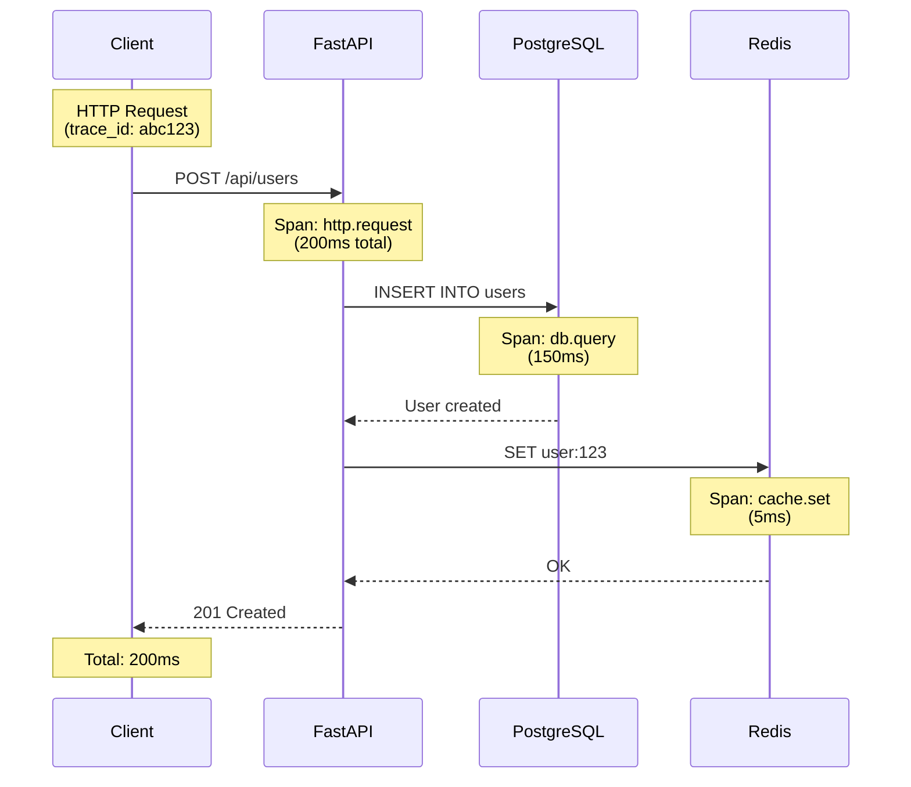

# Observability Strategy

This document explains the comprehensive observability strategy implemented in this FastAPI boilerplate, covering logging, tracing, metrics, and monitoring.

## Overview

Observability is the ability to understand the internal state of your system by examining its outputs. This boilerplate implements the three pillars of observability:

1. **Logs**: Structured records of discrete events
2. **Traces**: Request lifecycle across services
3. **Metrics**: Quantitative measurements over time

## Table of Contents

- [Structured Logging](#structured-logging)
- [Distributed Tracing](#distributed-tracing)
- [Metrics and Monitoring](#metrics-and-monitoring)
- [Health Checks](#health-checks)
- [Error Tracking](#error-tracking)
- [Performance Profiling](#performance-profiling)
- [Dashboard Design](#dashboard-design)
- [On-Call Runbooks](#on-call-runbooks)

## Structured Logging

### Why Structured Logging?

Traditional text logs:
```
2024-01-15 10:30:45 INFO User login successful john@example.com
```

Structured logs (JSON):
```json
{
  "timestamp": "2024-01-15T10:30:45Z",
  "level": "info",
  "message": "user_login_successful",
  "user_id": "123e4567-e89b-12d3-a456-426614174000",
  "email": "john@example.com",
  "tenant_id": "abc-123",
  "trace_id": "4bf92f3577b34da6a3ce929d0e0e4736"
}
```

Benefits:
- **Searchable**: Query by any field
- **Aggregatable**: Count, group, analyze
- **Correl table**: Link logs via trace_id
- **Machine-readable**: Easy to parse and process

### Implementation with Structlog

**Configuration**:

```python
import structlog

structlog.configure(
    processors=[
        structlog.contextvars.merge_contextvars,
        structlog.processors.add_log_level,
        structlog.processors.TimeStamper(fmt="iso"),
        structlog.processors.StackInfoRenderer(),
        structlog.processors.format_exc_info,
        structlog.processors.JSONRenderer()
    ],
    wrapper_class=structlog.make_filtering_bound_logger(logging.INFO),
    context_class=dict,
    logger_factory=structlog.PrintLoggerFactory(),
    cache_logger_on_first_use=True,
)
```

**Usage**:

```python
import structlog

logger = structlog.get_logger()

# Simple log
logger.info("user_created", user_id=user.id)

# With context
logger.bind(tenant_id=tenant.id).info(
    "order_placed",
    order_id=order.id,
    amount=order.total
)

# Error with exception
try:
    process_payment(order)
except PaymentError as e:
    logger.exception(
        "payment_failed",
        order_id=order.id,
        error_code=e.code
    )
```

### Request Context Binding

**Middleware to bind context**:

```python
async def logging_middleware(request: Request, call_next):
    # Bind request context to all logs
    structlog.contextvars.clear_contextvars()
    structlog.contextvars.bind_contextvars(
        request_id=request.headers.get("x-request-id"),
        tenant_id=request.state.tenant_id,
        user_id=request.state.user_id,
        path=request.url.path,
        method=request.method,
    )

    response = await call_next(request)

    logger.info(
        "request_completed",
        status_code=response.status_code,
        duration_ms=calculate_duration()
    )

    return response
```

Now all logs automatically include request context!

### Log Levels

Use appropriate log levels:

```python
# DEBUG: Detailed diagnostic information
logger.debug("cache_hit", key=cache_key)

# INFO: General informational messages
logger.info("user_registered", user_id=user.id)

# WARNING: Something unexpected but handled
logger.warning("rate_limit_approached", tenant_id=tenant.id)

# ERROR: Error that affects functionality
logger.error("payment_gateway_timeout", order_id=order.id)

# CRITICAL: System is unusable
logger.critical("database_connection_lost")
```

### Sensitive Data Sanitization

**Never log sensitive data**:

```python
# ❌ BAD: Logging sensitive data
logger.info("user_login", email=email, password=password)  # NEVER!

# ✅ GOOD: Sanitize or omit sensitive fields
logger.info("user_login", email=email, password="[REDACTED]")

# ✅ BETTER: Don't log password at all
logger.info("user_login", user_id=user.id)
```

**Automatic sanitization**:

```python
def sanitize_log_data(data: dict) -> dict:
    """Remove sensitive fields from logs."""
    sensitive_keys = {
        'password', 'token', 'api_key', 'secret',
        'credit_card', 'ssn', 'auth_token'
    }

    return {
        k: '[REDACTED]' if k in sensitive_keys else v
        for k, v in data.items()
    }
```

## Distributed Tracing

### Why Distributed Tracing?

Track a request as it flows through your system:



### OpenTelemetry Implementation

**Configuration**:

```python
from opentelemetry import trace
from opentelemetry.exporter.otlp.proto.grpc.trace_exporter import OTLPSpanExporter
from opentelemetry.instrumentation.fastapi import FastAPIInstrumentor
from opentelemetry.instrumentation.sqlalchemy import SQLAlchemyInstrumentor
from opentelemetry.sdk.trace import TracerProvider
from opentelemetry.sdk.trace.export import BatchSpanProcessor

# Set up tracer provider
trace.set_tracer_provider(TracerProvider())
tracer = trace.get_tracer(__name__)

# Configure exporter (Jaeger, Zipkin, or OTLP)
otlp_exporter = OTLPSpanExporter(
    endpoint="http://localhost:4317",
    insecure=True
)

# Add span processor
trace.get_tracer_provider().add_span_processor(
    BatchSpanProcessor(otlp_exporter)
)

# Auto-instrument FastAPI
FastAPIInstrumentor.instrument_app(app)

# Auto-instrument SQLAlchemy
SQLAlchemyInstrumentor().instrument(
    engine=engine,
    enable_commenter=True,  # Add SQL comments with trace info
)
```

**Manual Spans**:

```python
@tracer.start_as_current_span("process_order")
async def process_order(order: Order):
    # This function is now traced

    with tracer.start_as_current_span("validate_inventory"):
        await validate_inventory(order.items)

    with tracer.start_as_current_span("charge_payment"):
        await charge_payment(order.total)

    with tracer.start_as_current_span("send_confirmation"):
        await send_confirmation_email(order.user)
```

**Span Attributes**:

```python
with tracer.start_as_current_span("create_user") as span:
    span.set_attribute("tenant.id", str(tenant.id))
    span.set_attribute("user.email", user.email)
    span.set_attribute("user.role", user.role)

    user = await user_repo.create(user)

    span.set_attribute("user.id", str(user.id))
```

### Trace Propagation

**Between services** (via HTTP headers):

```python
import httpx
from opentelemetry.propagate import inject

headers = {}
inject(headers)  # Injects trace context into headers

async with httpx.AsyncClient() as client:
    response = await client.post(
        "http://other-service/api/endpoint",
        headers=headers,  # Propagates trace
        json=data
    )
```

**Between async tasks**:

```python
from opentelemetry import context

# Capture current context
ctx = context.get_current()

async def background_task():
    # Restore context in background task
    context.attach(ctx)

    with tracer.start_as_current_span("background_processing"):
        await process_data()
```

## Metrics and Monitoring

### Prometheus Metrics

**Types of metrics**:

1. **Counter**: Monotonically increasing (e.g., total requests)
2. **Gauge**: Can go up or down (e.g., active connections)
3. **Histogram**: Distribution of values (e.g., request duration)
4. **Summary**: Similar to histogram, with quantiles

**Implementation**:

```python
from prometheus_client import Counter, Histogram, Gauge

# Counter: Total requests
requests_total = Counter(
    'http_requests_total',
    'Total HTTP requests',
    ['method', 'endpoint', 'status']
)

# Histogram: Request duration
request_duration = Histogram(
    'http_request_duration_seconds',
    'HTTP request duration in seconds',
    ['method', 'endpoint']
)

# Gauge: Active connections
active_connections = Gauge(
    'active_database_connections',
    'Number of active database connections'
)

# Usage
@app.middleware("http")
async def metrics_middleware(request: Request, call_next):
    start_time = time.time()

    response = await call_next(request)

    duration = time.time() - start_time

    requests_total.labels(
        method=request.method,
        endpoint=request.url.path,
        status=response.status_code
    ).inc()

    request_duration.labels(
        method=request.method,
        endpoint=request.url.path
    ).observe(duration)

    return response
```

**Expose metrics endpoint**:

```python
from prometheus_client import generate_latest, CONTENT_TYPE_LATEST

@app.get("/metrics")
async def metrics():
    return Response(
        generate_latest(),
        media_type=CONTENT_TYPE_LATEST
    )
```

### Business Metrics

**Track business KPIs**:

```python
# Revenue metrics
revenue_total = Counter(
    'revenue_total_usd',
    'Total revenue in USD',
    ['tenant_id', 'product']
)

# User metrics
user_signups = Counter(
    'user_signups_total',
    'Total user signups',
    ['tenant_id', 'source']
)

# Usage metrics
api_calls_per_tenant = Counter(
    'api_calls_total',
    'API calls per tenant',
    ['tenant_id', 'endpoint']
)

# Usage
revenue_total.labels(
    tenant_id=tenant.id,
    product=product.name
).inc(order.total)
```

## Health Checks

### Liveness vs Readiness

**Liveness**: Is the app alive?
- Returns 200 if process is running
- Used by orchestrator to restart dead containers

**Readiness**: Is the app ready to serve traffic?
- Returns 200 if app can handle requests
- Used by load balancer to route traffic

**Implementation**:

```python
@app.get("/health/live")
async def liveness():
    """Liveness check - is the process alive?"""
    return {"status": "ok"}

@app.get("/health/ready")
async def readiness(
    db: AsyncSession = Depends(get_db),
    redis: Redis = Depends(get_redis),
):
    """Readiness check - can we serve requests?"""
    checks = {}

    # Check database
    try:
        await db.execute(text("SELECT 1"))
        checks["database"] = "ok"
    except Exception as e:
        checks["database"] = f"error: {e}"

    # Check Redis
    try:
        await redis.ping()
        checks["redis"] = "ok"
    except Exception as e:
        checks["redis"] = f"error: {e}"

    # Overall status
    is_ready = all(v == "ok" for v in checks.values())

    return JSONResponse(
        content={"status": "ready" if is_ready else "not_ready", "checks": checks},
        status_code=200 if is_ready else 503
    )
```

### Startup Checks

**Check dependencies on startup**:

```python
@app.on_event("startup")
async def startup_event():
    logger.info("application_starting")

    # Check database connection
    try:
        async with engine.begin() as conn:
            await conn.execute(text("SELECT 1"))
        logger.info("database_connection_ok")
    except Exception as e:
        logger.critical("database_connection_failed", error=str(e))
        raise

    # Check Redis connection
    try:
        await redis.ping()
        logger.info("redis_connection_ok")
    except Exception as e:
        logger.critical("redis_connection_failed", error=str(e))
        raise

    logger.info("application_started")
```

## Error Tracking

### Exception Handling

**Global exception handler**:

```python
@app.exception_handler(Exception)
async def global_exception_handler(request: Request, exc: Exception):
    logger.exception(
        "unhandled_exception",
        path=request.url.path,
        method=request.method,
        exc_type=type(exc).__name__
    )

    return JSONResponse(
        status_code=500,
        content={
            "error": "internal_server_error",
            "request_id": request.state.request_id
        }
    )
```

**Sentry Integration**:

```python
import sentry_sdk
from sentry_sdk.integrations.asgi import SentryAsgiMiddleware

sentry_sdk.init(
    dsn=settings.SENTRY_DSN,
    environment=settings.ENVIRONMENT,
    traces_sample_rate=0.1,  # 10% of requests
)

app.add_middleware(SentryAsgiMiddleware)
```

## Performance Profiling

### Application Profiling

**Py-Spy for CPU profiling**:

```bash
# Profile running application
py-spy record -o profile.svg --pid <pid>

# Profile for 60 seconds
py-spy record -o profile.svg --duration 60 --pid <pid>
```

**cProfile for code profiling**:

```python
import cProfile
import pstats

def profile_endpoint():
    profiler = cProfile.Profile()
    profiler.enable()

    # Your code here
    result = expensive_function()

    profiler.disable()
    stats = pstats.Stats(profiler)
    stats.sort_stats('cumulative')
    stats.print_stats(20)  # Top 20 functions

    return result
```

### Database Query Profiling

**Log slow queries**:

```python
@event.listens_for(Engine, "before_cursor_execute")
def before_cursor_execute(conn, cursor, statement, parameters, context, executemany):
    conn.info.setdefault('query_start_time', []).append(time.time())

@event.listens_for(Engine, "after_cursor_execute")
def after_cursor_execute(conn, cursor, statement, parameters, context, executemany):
    total = time.time() - conn.info['query_start_time'].pop()

    if total > 1.0:  # Log queries over 1 second
        logger.warning(
            "slow_query",
            duration=total,
            query=statement[:200]  # First 200 chars
        )
```

## Dashboard Design

### Key Metrics Dashboard

**RED Method** (Rate, Errors, Duration):

1. **Rate**: Requests per second
2. **Errors**: Error rate (%)
3. **Duration**: Response time (p50, p95, p99)

```
┌─────────────────────────────────────────┐
│ Request Rate                            │
│ ▂▃▅▇█▇▅▃▂ 1,234 req/s                  │
└─────────────────────────────────────────┘

┌─────────────────────────────────────────┐
│ Error Rate                              │
│ ▁▁▁▂▅▇█▅▂▁ 0.5%                        │
└─────────────────────────────────────────┘

┌─────────────────────────────────────────┐
│ Response Time                           │
│ p50:  45ms │ p95: 230ms │ p99: 890ms  │
└─────────────────────────────────────────┘
```

### Resource Utilization

```
CPU Usage:     ████████░░ 80%
Memory:        ██████████ 95%
Disk I/O:      ████░░░░░░ 40%
Network:       ██░░░░░░░░ 20%

Database Connections: 18/20
Redis Connections:     5/10
```

### Business Metrics

```
Revenue Today:        $12,345
Active Users:         1,234
API Calls (24h):      45,678
Failed Payments:      3
```

## On-Call Runbooks

### High Error Rate

**Symptoms**: Error rate > 5%

**Investigation**:
1. Check logs for common errors
2. Check recent deployments
3. Check database/Redis connectivity
4. Check external service status

**Mitigation**:
```bash
# Rollback deployment
kubectl rollout undo deployment/api

# Scale up if needed
kubectl scale deployment/api --replicas=10
```

### High Response Time

**Symptoms**: p95 response time > 1s

**Investigation**:
1. Check slow query logs
2. Check database connection pool
3. Check Redis cache hit rate
4. Profile application with py-spy

**Mitigation**:
```bash
# Add database connections
kubectl set env deployment/api DATABASE_POOL_SIZE=30

# Restart to clear memory leaks
kubectl rollout restart deployment/api
```

### Database Connection Issues

**Symptoms**: "Too many connections" errors

**Investigation**:
```sql
-- Check active connections
SELECT count(*) FROM pg_stat_activity;

-- Kill idle connections
SELECT pg_terminate_backend(pid)
FROM pg_stat_activity
WHERE state = 'idle' AND query_start < NOW() - INTERVAL '5 minutes';
```

**Mitigation**:
- Increase max_connections in PostgreSQL
- Reduce connection pool size per instance
- Add connection pooler (PgBouncer)

## Best Practices

1. **Log everything important**, but not too much
2. **Use structured logging** for easy searching
3. **Include trace_id** in all logs
4. **Monitor the right metrics** (RED + business KPIs)
5. **Set up alerts** for critical issues
6. **Create runbooks** for common issues
7. **Test observability** in development
8. **Use distributed tracing** for complex flows
9. **Profile in production** safely
10. **Review dashboards** regularly

## Further Reading

- [OpenTelemetry Documentation](https://opentelemetry.io/docs/)
- [Prometheus Best Practices](https://prometheus.io/docs/practices/)
- [Structured Logging Best Practices](https://www.structlog.org/)
- [Design Decisions](design-decisions.md) - Why we chose these tools
- [Deployment Guide](../how-to/deployment.md) - Production setup
