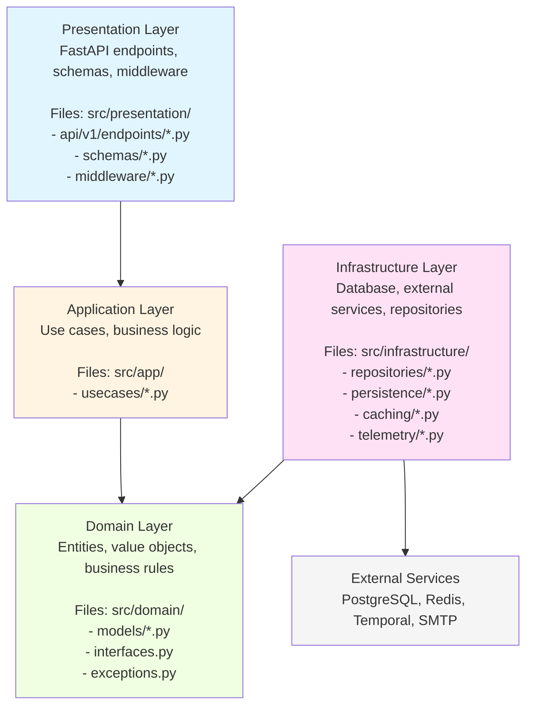

# Architecture Reference

## Overview

This project implements **Clean Architecture** (also known as Hexagonal Architecture or Ports & Adapters) combined with **Domain-Driven Design (DDD)** principles. The architecture ensures:

- **Independence**: Business logic doesn't depend on frameworks, UI, or databases
- **Testability**: Core business rules can be tested without external dependencies
- **Flexibility**: Easy to swap implementations (e.g., change database or add new API version)
- **Maintainability**: Clear separation of concerns makes code easier to understand and modify

## Architecture Layers



## Layer Details

### 1. Presentation Layer

**Purpose:** Handle HTTP requests/responses and API contracts

**Components:**
- **Endpoints** (`src/presentation/api/v1/endpoints/`): FastAPI routers defining HTTP routes
- **Schemas** (`src/presentation/schemas/`): Pydantic models for request/response validation
- **Dependencies** (`src/presentation/api/dependencies.py`): FastAPI dependency injection helpers
- **Middleware** (`src/presentation/middleware/`): Request/response interceptors

**Responsibilities:**
- Route HTTP requests to appropriate use cases
- Validate input data (Pydantic)
- Format responses (JSON serialization)
- Handle HTTP concerns (status codes, headers, etc.)
- API versioning

**Rules:**
- ✅ **CAN** depend on: Application layer (use cases), Domain layer (for type hints)
- ❌ **CANNOT** depend on: Infrastructure layer directly
- ❌ **CANNOT** contain: Business logic, database queries

**Example:**
```python
# src/presentation/api/v1/endpoints/users.py
@router.post("", response_model=UserResponse, status_code=201)
@inject
async def create_user(
    input: UserCreate,  # Pydantic schema
    use_case: Annotated[CreateUserUseCase, Depends(...)],  # Injected use case
    tenant_id: Annotated[UUID | None, Depends(get_tenant_id)] = None,
) -> UserResponse:
    user = await use_case.execute(...)  # Delegate to use case
    return UserResponse.model_validate(user)  # Return Pydantic model
```

### 2. Application Layer

**Purpose:** Orchestrate business operations and enforce business rules

**Components:**
- **Use Cases** (`src/app/usecases/`): Each use case = one business operation
- **DTOs** (optional): Data transfer objects between layers

**Responsibilities:**
- Implement business logic
- Coordinate between repositories
- Enforce business rules and validation
- Handle transactions (via Unit of Work)
- Independent of HTTP/UI concerns

**Rules:**
- ✅ **CAN** depend on: Domain layer (models, interfaces, exceptions)
- ❌ **CANNOT** depend on: Presentation layer, Infrastructure layer implementations
- ✅ **MUST** depend on: Interfaces only (e.g., `IUserRepository`, not `UserRepository`)

**Example:**
```python
# src/app/usecases/user_usecases.py
class CreateUserUseCase:
    def __init__(self, user_repository: IUserRepository) -> None:
        self._repository = user_repository  # Interface, not concrete class

    async def execute(self, email: str, username: str, ...) -> User:
        # Business rule: Check for duplicates
        existing = await self._repository.get_by_email(email)
        if existing:
            raise ValidationError("Email already exists")

        # Create entity
        user = User(email=email, username=username, ...)

        # Persist via repository
        return await self._repository.add(user)
```

### 3. Domain Layer

**Purpose:** Define business entities and core business rules

**Components:**
- **Models** (`src/domain/models/`): Business entities (User, Task, etc.)
- **Interfaces** (`src/domain/interfaces.py`): Repository contracts
- **Exceptions** (`src/domain/exceptions.py`): Domain-specific errors
- **Value Objects** (optional): Immutable domain concepts

**Responsibilities:**
- Define entity structure and behavior
- Enforce invariants (rules that must always be true)
- Provide repository interfaces (contracts)
- Independent of any framework or external service

**Rules:**
- ❌ **CANNOT** depend on: Any other layer
- ✅ **CAN** use: Standard Python library only
- ✅ **MUST** be: Framework-agnostic (no FastAPI, SQLAlchemy in logic)

**Example:**
```python
# src/domain/models/user.py
class User(Base, TimestampMixin, TenantMixin):
    """User domain entity."""

    email: Mapped[str] = mapped_column(String(255), unique=True, nullable=False)
    username: Mapped[str] = mapped_column(String(50), unique=True, nullable=False)
    is_active: Mapped[bool] = mapped_column(Boolean, default=True)

    def deactivate(self) -> None:
        """Business rule: Deactivate user."""
        self.is_active = False

    def activate(self) -> None:
        """Business rule: Activate user."""
        self.is_active = True


# src/domain/interfaces.py
class IUserRepository(IRepository[User]):
    """User repository interface (contract)."""

    async def get_by_email(self, email: str) -> User | None:
        """Get user by email."""
        ...

    async def get_by_username(self, username: str) -> User | None:
        """Get user by username."""
        ...
```

### 4. Infrastructure Layer

**Purpose:** Implement technical concerns and external integrations

**Components:**
- **Repositories** (`src/infrastructure/repositories/`): Database access implementations
  - `BaseRepository[T]` - Generic repository for CRUD operations
  - `CachedBaseRepository[T]` - Generic cached repository decorator
  - Entity-specific repositories (e.g., `UserRepository`, `CachedUserRepository`)
- **Persistence** (`src/infrastructure/persistence/`): Database session, Unit of Work
- **Cache** (`src/infrastructure/cache/`): Redis cache implementation
- **Telemetry** (`src/infrastructure/telemetry/`): OpenTelemetry setup
- **External Services** (`src/external/`): Third-party API clients

**Responsibilities:**
- Implement repository interfaces
- Handle database connections and transactions
- Cache management (via decorator pattern)
- External API calls
- File storage
- Message queues

**Rules:**
- ✅ **CAN** depend on: Domain layer (to implement interfaces)
- ✅ **MUST** implement: Domain interfaces
- ❌ **CANNOT** depend on: Application layer, Presentation layer

**Example:**
```python
# src/infrastructure/repositories/user_repository.py
class UserRepository(BaseRepository[User], IUserRepository):
    """Concrete implementation of IUserRepository."""

    def __init__(self, session: AsyncSession) -> None:
        super().__init__(session, User)

    async def get_by_email(self, email: str) -> User | None:
        query = select(User).where(User.email == email)
        result = await self._session.execute(query)
        return result.scalar_one_or_none()

    async def get_by_username(self, username: str) -> User | None:
        query = select(User).where(User.username == username)
        result = await self._session.execute(query)
        return result.scalar_one_or_none()
```

## Dependency Flow

**The Dependency Rule:** Dependencies flow inward. Outer layers depend on inner layers, never the reverse.

```
Presentation → Application → Domain
    ↓              ↓
Infrastructure (implements Domain interfaces)
```

**Key principle:** The Domain layer is the core and has ZERO dependencies. Everything else depends on it.

## Dependency Injection

We use **dependency-injector** library to wire up dependencies and follow the Dependency Inversion Principle.

### Container Configuration

```python
# src/container.py
class Container(containers.DeclarativeContainer):
    # Config
    config = providers.Configuration()

    # Database
    db = providers.Singleton(
        Database,
        connection_string=config.database_url,
    )

    # Repositories (Infrastructure)
    user_repository = providers.Factory(
        UserRepository,  # Concrete implementation
        session=db.session,
    )

    # Use Cases (Application)
    use_cases = providers.FactoryAggregate(
        create_user=providers.Factory(
            CreateUserUseCase,
            user_repository=user_repository,  # Inject dependency
        ),
    )
```

### Injection in Endpoints

```python
# src/presentation/api/v1/endpoints/users.py
@router.post("")
@inject  # This decorator enables dependency injection
async def create_user(
    input: UserCreate,
    use_case: Annotated[
        CreateUserUseCase,
        Depends(Provide[Container.use_cases.create_user])  # Get from container
    ],
) -> UserResponse:
    user = await use_case.execute(...)
    return UserResponse.model_validate(user)
```

## Design Patterns

### Repository Pattern

**Purpose:** Abstract data access logic from business logic

**Implementation:**
1. Define interface in Domain layer (`IUserRepository`)
2. Implement in Infrastructure layer (`UserRepository`)
3. Use case depends on interface, not implementation

**Benefits:**
- Business logic doesn't know about database
- Easy to swap database (PostgreSQL → MongoDB)
- Easy to mock for testing

### Unit of Work Pattern

**Purpose:** Manage database transactions across multiple operations

**Implementation:**
```python
# src/infrastructure/persistence/unit_of_work.py
class UnitOfWork:
    async def __aenter__(self):
        self.session = await get_session()
        return self

    async def __aexit__(self, exc_type, exc_val, exc_tb):
        if exc_type:
            await self.session.rollback()
        else:
            await self.session.commit()
        await self.session.close()

# Usage in use case
async def batch_create_users(self, users: list[UserCreate]) -> list[User]:
    async with UnitOfWork() as uow:
        created_users = []
        for user_data in users:
            user = User(**user_data.dict())
            created_users.append(user)
            uow.session.add(user)
        # Auto-commit when context exits (or rollback on error)
    return created_users
```

### Factory Pattern

**Purpose:** Create complex objects

**Implementation:**
- Dependency Injector's `Factory` provider
- Used to create use cases, repositories with their dependencies

### Decorator Pattern

**Purpose:** Add behavior to existing classes

**Examples:**
- `CachedBaseRepository` - Adds Redis caching to repository methods via inheritance
- `@inject` - Enables dependency injection in FastAPI endpoints
- `@router.get()` - FastAPI routing decorator

### Generic Cached Repository Pattern

**Purpose:** Add caching to any repository without code duplication

**Implementation:**

```python
# 1. Generic base class provides caching for common operations
class CachedBaseRepository[T: BaseEntity](IRepository[T], ABC):
    """Generic cached repository with cache-aside pattern."""

    def __init__(self, repository: IRepository[T], cache: RedisCache, default_ttl: int = 300):
        self._repository = repository
        self._cache = cache
        self._default_ttl = default_ttl

    @abstractmethod
    def _get_cache_key_by_id(self, id: UUID) -> str:
        """Subclasses define cache key format (e.g., 'user:{id}')."""
        ...

    @abstractmethod
    def _get_all_cache_keys(self, entity: T) -> list[str]:
        """Subclasses define all cache keys for invalidation."""
        ...

    async def get_by_id(self, id: UUID, include_deleted: bool = False) -> T | None:
        """Cached get_by_id implementation."""
        if include_deleted:
            return await self._repository.get_by_id(id, include_deleted=True)

        # Cache-aside pattern: check cache → DB fallback → populate cache
        cache_key = self._get_cache_key_by_id(id)
        cached = await self._cache.get(cache_key)
        if cached:
            return self._model_class(**cached)

        entity = await self._repository.get_by_id(id, include_deleted=False)
        if entity:
            await self._cache.set(cache_key, entity, ttl=self._default_ttl)
        return entity

    async def update(self, entity: T) -> T:
        """Update with cache invalidation."""
        updated = await self._repository.update(entity)
        if updated:
            # Invalidate all related cache keys
            for key in self._get_all_cache_keys(updated):
                await self._cache.delete(key)
        return updated

# 2. Entity-specific repository extends generic base
class CachedUserRepository(CachedBaseRepository[User], IUserRepository[User]):
    """User repository with caching."""

    def _get_cache_key_by_id(self, id: UUID) -> str:
        return f"user:{id}"

    def _get_all_cache_keys(self, entity: User) -> list[str]:
        return [
            f"user:{entity.id}",
            f"user:email:{entity.email.lower()}",
            f"user:username:{entity.username.lower()}"
        ]

    # Add entity-specific cached methods
    async def get_by_email(self, email: str) -> User | None:
        cache_key = f"user:email:{email.lower()}"
        cached = await self._cache.get(cache_key)
        if cached:
            return User(**cached)

        user = await self._repository.get_by_email(email)
        if user:
            await self._cache.set(cache_key, user, ttl=self._default_ttl)
        return user
```

**Benefits:**
- **DRY Principle** - Common caching logic written once
- **Type Safety** - Generic type parameter ensures type correctness
- **Flexible** - Easy to add entity-specific caching (email, username, etc.)
- **Testable** - Generic base class has comprehensive tests
- **Cache Strategy** - Cache-aside pattern with automatic invalidation

**Cache Strategy:**
- **Read Operations:** Cache hits return immediately; cache misses fetch from DB and populate cache
- **Write Operations:** Update DB first, then invalidate all related cache keys
- **TTL:** Configurable per repository (default 300 seconds)
- **Compression:** Automatic compression for large cached values (zstd)
- **Not Cached:** List operations, search queries, deleted entities (too complex/dynamic)

## Multi-Tenancy

**Implementation:** Tenant isolation at multiple layers

### Database Level
- Every entity has `tenant_id: UUID | None`
- Queries automatically filter by tenant_id

### Application Level
- Use cases enforce tenant isolation
- Reject access to resources from other tenants

### API Level
- Extract tenant ID from `X-Tenant-Token` JWT header
- Pass to use cases for filtering

```python
# Extract tenant from JWT token
from jwt import decode
token = request.headers.get("X-Tenant-Token")
payload = decode(token, SECRET_KEY, algorithms=["HS256"])
tenant_id: UUID = UUID(payload["tenant_id"])

# Use case enforces isolation
user = await use_case.execute(user_id=user_id, tenant_id=tenant_id)

# Repository filters by tenant
query = select(User).where(User.id == user_id)
if tenant_id:
    query = query.where(User.tenant_id == tenant_id)
```

## Testing Strategy

### Unit Tests
- Test use cases with mocked repositories
- Test domain logic without database
- Fast, isolated, no external dependencies

```python
@pytest.fixture
def mock_repository():
    repo = Mock(spec=IUserRepository)
    return repo

async def test_create_user_success(mock_repository):
    use_case = CreateUserUseCase(mock_repository)
    # Test business logic in isolation
```

### Integration Tests
- Test endpoints with real database (test DB)
- Test repository implementations
- Verify layers work together

```python
async def test_create_user_endpoint(client: TestClient):
    response = client.post("/api/v1/users", json={...})
    assert response.status_code == 201
```

## File Structure

```
src/
├── app/                      # Application Layer
│   └── usecases/            # Use cases (business logic)
│       ├── user_usecases.py
│       └── task_usecases.py
│
├── domain/                   # Domain Layer
│   ├── models/              # Entities
│   │   ├── user.py
│   │   └── task.py
│   ├── interfaces.py        # Repository interfaces
│   ├── exceptions.py        # Domain exceptions
│   └── pagination.py        # Value objects
│
├── infrastructure/           # Infrastructure Layer
│   ├── repositories/        # Repository implementations
│   │   ├── base_repository.py         # Generic CRUD repository
│   │   ├── cached_base_repository.py  # Generic cached repository
│   │   ├── user_repository.py         # User-specific repository
│   │   └── cached_user_repository.py  # Cached user repository
│   ├── persistence/         # Database management
│   │   ├── base.py         # SQLAlchemy base
│   │   ├── database.py     # Session factory
│   │   └── unit_of_work.py # Transaction management
│   ├── cache/              # Redis cache implementation
│   │   └── redis_cache.py  # Cache with compression & metrics
│   └── telemetry/          # OpenTelemetry setup
│       └── setup.py
│
├── presentation/             # Presentation Layer
│   ├── api/
│   │   ├── v1/
│   │   │   ├── endpoints/  # FastAPI routers
│   │   │   │   ├── users.py
│   │   │   │   └── tasks.py
│   │   │   └── __init__.py
│   │   └── dependencies.py # FastAPI dependencies
│   ├── schemas/            # Pydantic models
│   │   ├── user.py
│   │   └── task.py
│   └── middleware/         # HTTP middleware
│       └── request_context.py
│
├── external/                 # External service clients
│   └── temporal/            # Temporal workflow client
│
├── utils/                    # Shared utilities
│   └── uuidv7.py
│
└── container.py              # Dependency injection container
```

## Best Practices

### ✅ DO

1. **Keep use cases focused** - One use case = one operation
2. **Use interfaces** - Depend on abstractions, not implementations
3. **Validate at boundaries** - Validate input in API schemas, business rules in use cases
4. **Handle errors properly** - Use domain exceptions, convert to HTTP errors at API layer
5. **Test each layer** - Unit tests for use cases, integration tests for endpoints
6. **Document decisions** - Add ADRs for architectural choices

### ❌ DON'T

1. **Don't put business logic in endpoints** - Endpoints should be thin, delegating to use cases
2. **Don't access database from endpoints** - Always go through use cases and repositories
3. **Don't couple layers** - Respect dependency direction
4. **Don't skip validation** - Validate at API layer (Pydantic) AND business layer (use cases)
5. **Don't ignore transactions** - Use Unit of Work for operations affecting multiple entities

## Common Questions

**Q: Why not just use FastAPI with SQLAlchemy directly?**
A: Clean Architecture makes the codebase more maintainable, testable, and flexible. You can change databases, frameworks, or add new API versions without rewriting business logic.

**Q: Isn't this over-engineering for a small project?**
A: It's a boilerplate for enterprise applications. The structure pays off as the project grows. For small projects, you might simplify.

**Q: How do I add a new entity?**
A: Follow this order: Domain Model → Repository Interface → Repository Implementation → Use Cases → API Schema → Endpoint → Register in Container

**Q: Where should I put validation logic?**
A:
- **API validation** (format, required fields): Pydantic schemas
- **Business validation** (duplicates, rules): Use cases
- **Database constraints** (unique, foreign keys): SQLAlchemy models

**Q: Can I skip layers?**
A: No. Always respect the dependency flow. If you need to access data, create a use case that uses a repository.

## Further Reading

- [Clean Architecture by Robert C. Martin](https://blog.cleancoder.com/uncle-bob/2012/08/13/the-clean-architecture.html)
- [Hexagonal Architecture](https://alistair.cockburn.us/hexagonal-architecture/)
- [Domain-Driven Design](https://martinfowler.com/bliki/DomainDrivenDesign.html)
- [Design Decisions](../explanation/design-decisions.md)
- [Clean Architecture Deep Dive](../explanation/clean-architecture.md)
