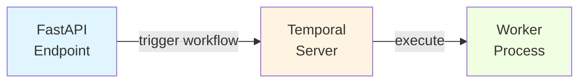

# Tutorial: Background Jobs with Temporal

**Time**: 25 minutes
**Prerequisite**: Complete [First API Tutorial](01-first-api.md)

Learn how to process long-running tasks asynchronously using Temporal workflows.

## What You'll Build

An **Email Notification System** with:
- Async email sending workflow
- Retry logic with exponential backoff
- Activity timeouts and error handling
- Workflow testing
- Temporal UI monitoring

## Table of Contents

1. [Understanding Temporal](#step-1-understanding-temporal)
2. [Create Email Activity](#step-2-create-email-activity)
3. [Define Workflow](#step-3-define-workflow)
4. [Register Worker](#step-4-register-worker)
5. [Trigger from API](#step-5-trigger-from-api)
6. [Add Retry Logic](#step-6-add-retry-logic)
7. [Test Workflows](#step-7-test-workflows)
8. [Monitor in Temporal UI](#step-8-monitor-in-temporal-ui)

---

## Step 1: Understanding Temporal

### What is Temporal?

Temporal is a durable execution platform that guarantees your workflows run to completion, even if:
- Worker crashes
- Network fails
- Server restarts
- Code deploys

### Key Concepts

**Workflow**: Long-running business logic (durable, can run for days/weeks)
**Activity**: Single task within a workflow (can fail and retry)
**Worker**: Process that executes workflows and activities
**Task Queue**: Named queue for routing work to workers

### Architecture



---

## Step 2: Create Email Activity

Activities are single, retriable tasks.

### 2.1 Create Activity Function

```python
# src/core/infrastructure/temporal/activities/email_activities.py
from temporalio import activity
from dataclasses import dataclass
import asyncio

@dataclass
class SendEmailInput:
    """Input for send_email activity."""
    to: str
    subject: str
    body: str

@activity.defn(name="send_email")
async def send_email(input: SendEmailInput) -> str:
    """
    Send an email via SMTP.

    This activity can be retried if it fails.
    Temporal will automatically handle retries based on the retry policy.
    """
    activity.logger.info(f"Sending email to {input.to}: {input.subject}")

    try:
        # Simulate sending email (replace with actual SMTP logic)
        await asyncio.sleep(2)  # Simulate network delay

        # In production, use aiosmtplib or similar
        # async with aiosmtplib.SMTP(hostname="smtp.gmail.com", port=587) as smtp:
        #     await smtp.login(username, password)
        #     await smtp.send_message(message)

        activity.logger.info(f"Email sent successfully to {input.to}")
        return f"Email sent to {input.to}"

    except Exception as e:
        activity.logger.error(f"Failed to send email: {e}")
        raise  # Temporal will retry based on retry policy
```

### 2.2 Create Activity with External Service

```python
# src/core/infrastructure/temporal/activities/notification_activities.py
from temporalio import activity
from dataclasses import dataclass
import httpx

@dataclass
class SendSlackInput:
    channel: str
    message: str

@activity.defn(name="send_slack_notification")
async def send_slack_notification(input: SendSlackInput) -> str:
    """Send notification to Slack."""
    activity.logger.info(f"Sending Slack message to {input.channel}")

    # Use httpx for async HTTP requests
    async with httpx.AsyncClient() as client:
        response = await client.post(
            "https://hooks.slack.com/services/YOUR/WEBHOOK/URL",
            json={"channel": input.channel, "text": input.message},
            timeout=10.0
        )
        response.raise_for_status()

    return f"Slack message sent to {input.channel}"
```

**What we did:**
- ✅ Created activity functions with `@activity.defn`
- ✅ Used `activity.logger` for Temporal-aware logging
- ✅ Defined input dataclasses for type safety
- ✅ Handled errors (Temporal will retry automatically)

---

## Step 3: Define Workflow

Workflows orchestrate activities with durable execution.

### 3.1 Create Email Workflow

```python
# src/core/infrastructure/temporal/workflows/email_workflows.py
from temporalio import workflow
from datetime import timedelta
from dataclasses import dataclass

# Import activity (must use with_start_workflow to reference)
from src.core.infrastructure.temporal.activities.email_activities import (
    send_email,
    SendEmailInput
)

@dataclass
class SendWelcomeEmailInput:
    """Input for welcome email workflow."""
    user_email: str
    user_name: str

@workflow.defn(name="send_welcome_email")
class SendWelcomeEmailWorkflow:
    """
    Workflow for sending welcome email to new users.

    This workflow:
    1. Sends welcome email
    2. Waits 3 days
    3. Sends follow-up email
    """

    @workflow.run
    async def run(self, input: SendWelcomeEmailInput) -> str:
        """Execute the workflow."""
        workflow.logger.info(f"Starting welcome email workflow for {input.user_email}")

        # Step 1: Send welcome email
        welcome_result = await workflow.execute_activity(
            send_email,
            SendEmailInput(
                to=input.user_email,
                subject=f"Welcome {input.user_name}!",
                body=f"Hello {input.user_name}, welcome to our platform!"
            ),
            start_to_close_timeout=timedelta(minutes=5),  # Activity timeout
            retry_policy={
                "maximum_attempts": 3,
                "initial_interval": timedelta(seconds=1),
                "maximum_interval": timedelta(seconds=10),
                "backoff_coefficient": 2.0,
            }
        )
        workflow.logger.info(f"Welcome email sent: {welcome_result}")

        # Step 2: Wait 3 days (workflow sleeps durably)
        workflow.logger.info("Waiting 3 days before follow-up...")
        await workflow.sleep(timedelta(days=3))

        # Step 3: Send follow-up email
        followup_result = await workflow.execute_activity(
            send_email,
            SendEmailInput(
                to=input.user_email,
                subject="How are you finding our platform?",
                body=f"Hi {input.user_name}, we'd love to hear your feedback!"
            ),
            start_to_close_timeout=timedelta(minutes=5)
        )
        workflow.logger.info(f"Follow-up email sent: {followup_result}")

        return f"Completed welcome workflow for {input.user_email}"
```

### 3.2 Create Parallel Workflow

```python
# src/core/infrastructure/temporal/workflows/notification_workflows.py
from temporalio import workflow
from datetime import timedelta
import asyncio

@workflow.defn(name="send_multi_channel_notification")
class MultiChannelNotificationWorkflow:
    """Send notifications to multiple channels in parallel."""

    @workflow.run
    async def run(self, message: str) -> str:
        """Send notifications in parallel."""

        # Execute activities in parallel
        email_task = workflow.execute_activity(
            send_email,
            SendEmailInput(to="admin@example.com", subject="Alert", body=message),
            start_to_close_timeout=timedelta(minutes=5)
        )

        slack_task = workflow.execute_activity(
            send_slack_notification,
            SendSlackInput(channel="#alerts", message=message),
            start_to_close_timeout=timedelta(minutes=5)
        )

        # Wait for all to complete
        results = await asyncio.gather(email_task, slack_task)

        return f"Notifications sent: {results}"
```

**What we did:**
- ✅ Created workflow class with `@workflow.defn`
- ✅ Defined `run` method as workflow entry point
- ✅ Used `workflow.execute_activity` to run activities
- ✅ Added retry policies with exponential backoff
- ✅ Used `workflow.sleep` for durable waiting
- ✅ Executed activities in parallel with `asyncio.gather`

---

## Step 4: Register Worker

Workers execute workflows and activities.

### 4.1 Create Worker Script

```python
# src/core/infrastructure/temporal/worker.py
import asyncio
from temporalio.client import Client
from temporalio.worker import Worker

# Import workflows and activities
from src.core.infrastructure.temporal.workflows.email_workflows import (
    SendWelcomeEmailWorkflow
)
from src.core.infrastructure.temporal.activities.email_activities import (
    send_email
)

async def main():
    """Start Temporal worker."""
    # Connect to Temporal server
    client = await Client.connect("temporal:7233")

    # Create worker with workflows and activities
    worker = Worker(
        client,
        task_queue="email-tasks",  # Task queue name
        workflows=[SendWelcomeEmailWorkflow],  # Register workflows
        activities=[send_email],  # Register activities
    )

    print("Worker started, listening on task queue: email-tasks")
    await worker.run()

if __name__ == "__main__":
    asyncio.run(main())
```

### 4.2 Update docker-compose.yml

```yaml
# docker-compose.yml
services:
  # ... existing services ...

  worker:
    build: .
    command: python -m src.core.infrastructure.temporal.worker
    environment:
      - DATABASE_URL=postgresql+asyncpg://postgres:postgres@db:5432/app_db
      - TEMPORAL_HOST=temporal:7233
    depends_on:
      - db
      - temporal
    restart: unless-stopped
```

### 4.3 Start Worker

```bash
docker compose up worker
```

**Expected output:**
```
worker_1  | Worker started, listening on task queue: email-tasks
```

---

## Step 5: Trigger from API

Trigger workflows from FastAPI endpoints.

### 5.1 Create Temporal Client Dependency

```python
# src/core/infrastructure/dependencies.py
from temporalio.client import Client

async def get_temporal_client() -> Client:
    """Get Temporal client."""
    return await Client.connect("temporal:7233")
```

### 5.2 Create API Endpoint

```python
# src/api/v1/endpoints/users.py
from fastapi import APIRouter, Depends, status
from temporalio.client import Client

from src.api.v1.schemas.user import UserCreate, UserResponse
from src.core.infrastructure.dependencies import get_temporal_client
from src.core.infrastructure.temporal.workflows.email_workflows import (
    SendWelcomeEmailInput
)

router = APIRouter(prefix="/users", tags=["users"])

@router.post("/", response_model=UserResponse, status_code=status.HTTP_201_CREATED)
async def create_user(
    data: UserCreate,
    temporal_client: Client = Depends(get_temporal_client)
) -> UserResponse:
    """Create user and trigger welcome email workflow."""

    # 1. Create user in database (existing logic)
    user = await user_repository.create(data)

    # 2. Trigger async workflow
    await temporal_client.start_workflow(
        "send_welcome_email",  # Workflow name
        SendWelcomeEmailInput(
            user_email=user.email,
            user_name=user.full_name
        ),
        id=f"welcome-email-{user.id}",  # Unique workflow ID
        task_queue="email-tasks"  # Must match worker task queue
    )

    return UserResponse.model_validate(user)
```

### 5.3 Test the Endpoint

```bash
curl -X POST http://localhost:8000/api/v1/users \
  -H "Content-Type: application/json" \
  -d '{
    "email": "john@example.com",
    "username": "john_doe",
    "full_name": "John Doe"
  }'
```

**What happens:**
1. ✅ User created in database
2. ✅ Workflow triggered asynchronously
3. ✅ API returns immediately (doesn't wait for email)
4. ✅ Worker processes workflow in background

---

## Step 6: Add Retry Logic

Configure retry policies for resilience.

### 6.1 Activity Retry Policy

```python
# Exponential backoff retry
await workflow.execute_activity(
    send_email,
    SendEmailInput(...),
    retry_policy={
        "maximum_attempts": 5,  # Max 5 retries
        "initial_interval": timedelta(seconds=1),  # Start with 1s
        "maximum_interval": timedelta(minutes=5),  # Max 5min between retries
        "backoff_coefficient": 2.0,  # Double each time: 1s, 2s, 4s, 8s, 16s...
        "non_retryable_error_types": ["ValueError"],  # Don't retry these
    }
)
```

### 6.2 Retry Schedule

```
Attempt 1: Fails → Wait 1 second
Attempt 2: Fails → Wait 2 seconds
Attempt 3: Fails → Wait 4 seconds
Attempt 4: Fails → Wait 8 seconds
Attempt 5: Fails → Give up
```

### 6.3 Activity Timeout

```python
await workflow.execute_activity(
    send_email,
    SendEmailInput(...),
    start_to_close_timeout=timedelta(minutes=5),  # Activity must complete in 5min
    schedule_to_close_timeout=timedelta(hours=1),  # Including retries
    schedule_to_start_timeout=timedelta(minutes=2),  # Must start within 2min
)
```

**Timeout Types:**
- `start_to_close`: Time from start to completion (single attempt)
- `schedule_to_close`: Total time including retries
- `schedule_to_start`: Time waiting in queue before starting

---

## Step 7: Test Workflows

### 7.1 Unit Test Activity

```python
# tests/unit/test_email_activities.py
import pytest
from src.core.infrastructure.temporal.activities.email_activities import (
    send_email,
    SendEmailInput
)

@pytest.mark.asyncio
async def test_send_email_success():
    """Test send_email activity succeeds."""
    # Arrange
    input_data = SendEmailInput(
        to="test@example.com",
        subject="Test",
        body="Test message"
    )

    # Act
    result = await send_email(input_data)

    # Assert
    assert result == "Email sent to test@example.com"
```

### 7.2 Integration Test Workflow

```python
# tests/integration/test_email_workflows.py
import pytest
from temporalio.testing import WorkflowEnvironment
from temporalio.worker import Worker

from src.core.infrastructure.temporal.workflows.email_workflows import (
    SendWelcomeEmailWorkflow,
    SendWelcomeEmailInput
)
from src.core.infrastructure.temporal.activities.email_activities import send_email

@pytest.mark.asyncio
async def test_welcome_email_workflow():
    """Test welcome email workflow executes successfully."""
    # Arrange: Create test environment
    async with await WorkflowEnvironment.start_local() as env:
        # Create worker
        async with Worker(
            env.client,
            task_queue="test-queue",
            workflows=[SendWelcomeEmailWorkflow],
            activities=[send_email]
        ):
            # Act: Execute workflow
            result = await env.client.execute_workflow(
                SendWelcomeEmailWorkflow.run,
                SendWelcomeEmailInput(
                    user_email="test@example.com",
                    user_name="Test User"
                ),
                id="test-workflow-1",
                task_queue="test-queue"
            )

            # Assert
            assert "Completed welcome workflow" in result
```

**What we did:**
- ✅ Unit tested activity in isolation
- ✅ Integration tested workflow with test environment
- ✅ Used `WorkflowEnvironment` for deterministic testing

---

## Step 8: Monitor in Temporal UI

### 8.1 Access Temporal UI

```
http://localhost:8233
```

### 8.2 View Workflow Execution

1. Click on **Workflows**
2. Find your workflow by ID: `welcome-email-{user_id}`
3. View execution history:
   - Activity started
   - Activity completed
   - Workflow sleeping
   - Next activity scheduled

### 8.3 Workflow History

```
Event 1: WorkflowExecutionStarted
Event 2: WorkflowTaskScheduled
Event 3: WorkflowTaskStarted
Event 4: ActivityTaskScheduled (send_email)
Event 5: ActivityTaskStarted
Event 6: ActivityTaskCompleted
Event 7: TimerStarted (3 days sleep)
...
```

### 8.4 Query Workflow Status

```python
# Query workflow from Python
workflow_handle = temporal_client.get_workflow_handle("welcome-email-123")
result = await workflow_handle.result()
print(result)  # "Completed welcome workflow for john@example.com"
```

---

## Real-World Examples

### Example 1: Data Processing Pipeline

```python
@workflow.defn
class DataProcessingWorkflow:
    @workflow.run
    async def run(self, file_url: str) -> str:
        # Step 1: Download file
        file_path = await workflow.execute_activity(
            download_file,
            file_url,
            start_to_close_timeout=timedelta(minutes=10)
        )

        # Step 2: Process data
        processed = await workflow.execute_activity(
            process_data,
            file_path,
            start_to_close_timeout=timedelta(hours=2)
        )

        # Step 3: Upload results
        result_url = await workflow.execute_activity(
            upload_results,
            processed,
            start_to_close_timeout=timedelta(minutes=10)
        )

        return result_url
```

### Example 2: Scheduled Cleanup Job

```python
@workflow.defn
class CleanupWorkflow:
    @workflow.run
    async def run(self) -> str:
        while True:
            # Run cleanup activity
            await workflow.execute_activity(
                cleanup_old_data,
                start_to_close_timeout=timedelta(minutes=30)
            )

            # Wait 24 hours
            await workflow.sleep(timedelta(days=1))
```

---

## Troubleshooting

### Issue: "Worker not registered for task queue"

**Problem:** Workflow triggered but no worker listening.

**Solution:** Ensure worker is running and task queue matches:
```python
# Worker
worker = Worker(client, task_queue="email-tasks", ...)

# Trigger
await client.start_workflow(..., task_queue="email-tasks")
```

### Issue: Activity timeout

**Problem:** Activity takes too long.

**Solution:** Increase timeout or optimize activity:
```python
start_to_close_timeout=timedelta(minutes=10)  # Increase from 5 to 10
```

### Issue: Workflow stuck in running state

**Problem:** Workflow not completing.

**Solution:** Check worker logs for errors:
```bash
docker compose logs worker
```

---

## Best Practices

### DO ✅

- Use activities for non-deterministic operations (API calls, random numbers, timestamps)
- Keep workflows deterministic (no direct I/O, use activities)
- Add retry policies to activities
- Use workflow.sleep() instead of asyncio.sleep()
- Test workflows with WorkflowEnvironment
- Monitor workflows in Temporal UI

### DON'T ❌

- Don't use asyncio.sleep() in workflows (use workflow.sleep())
- Don't make HTTP calls directly in workflows (use activities)
- Don't use random() in workflows (use activity)
- Don't access database directly in workflows (use activity)
- Don't store large data in workflow state (use activities to persist)

---

## Next Steps

- 📖 [Architecture Reference](../reference/architecture.md) - Understand Clean Architecture
- 🔧 [Debugging Guide](../how-to/debugging.md) - Debug Temporal workflows
- 🚀 [Deployment Guide](../how-to/deployment.md) - Deploy with Temporal

---

## Summary

You learned:
- ✅ Create Temporal activities for retriable tasks
- ✅ Define workflows with durable execution
- ✅ Register workers to process workflows
- ✅ Trigger workflows from FastAPI endpoints
- ✅ Configure retry policies with exponential backoff
- ✅ Test workflows with WorkflowEnvironment
- ✅ Monitor workflow execution in Temporal UI
- ✅ Handle timeouts and error scenarios
- ✅ Follow best practices for deterministic workflows
